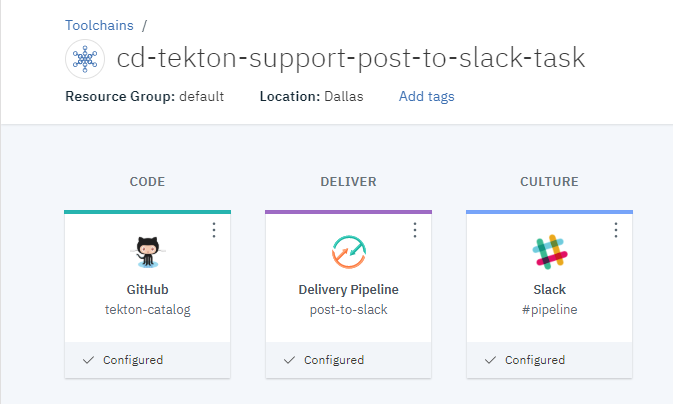

# Post to Slack task helper
This Task sends a message to the Slack channel(s) integrated to your [Continuous Delivery toolchain](https://cloud.ibm.com/docs/services/ContinuousDelivery?topic=ContinuousDelivery-integrations#slack).

## Prereq
### Slack
Create a [Slack Webhook](https://api.slack.com/messaging/webhooks).
### Toolchain
Add a [Slack integration](https://cloud.ibm.com/docs/services/ContinuousDelivery?topic=ContinuousDelivery-integrations#slack) to your [Continuous Delivery toolchain](https://cloud.ibm.com/docs/services/ContinuousDelivery?topic=ContinuousDelivery-toolchains-using)
## Install the Task
- Add a github integration in your toolchain to the repository containing the task (https://github.com/open-toolchain/tekton-catalog)
- Add that github integration to the Definitions tab of your Continuous Delivery tekton pipeline, with the Path set to `communication`.

## Inputs
None.
### Parameters

* **task-pvc**: the output pvc - this is where the cloned repository will be stored
* **channel**: (optional) the Slack channel to send the message to. (default value is '': all channels integrated to the toolchain will be notified).
* **messageFormat**: (optional) the format of the message. Value: text(default) or JSON.
* **messageScript**: (optional) Shell script that provides messsage content.
* **message**: (optional) the message to send to Slack.

## Output
None.

## Usage
The `sample` sub-directory contains an EventListener definition that you can include in your Tekton pipeline configuration to run an example of the `task-post-slack`

1) Create or update a toolchain so it includes:
   - a Slack integration
   - the repository containing this tekton task
   - a Tekton pipeline definition

   

2) Add the definitions of this task and the sample (`communication` and `communication/sample` paths)

   

3) (optional) Add the environment properties:

   - `channel` the channel to post to.
   - `messageFormat` the format of the message (text or JSON).
   - `message` the message to post to Slack.

   

4) Create a manual trigger to start the sample listener

   

5) Run the pipeline

6) The message is posted to Slack

   

7) Optional: check the execution log

   