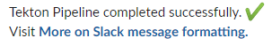
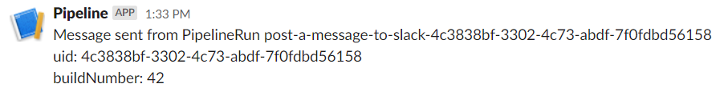
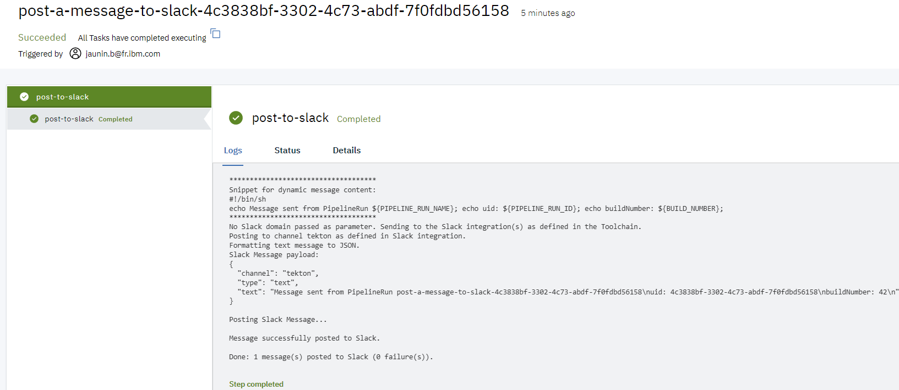

# Post to Slack task helper
This Task posts a message to the Slack channel(s) integrated with your [Continuous Delivery toolchain](https://cloud.ibm.com/docs/services/ContinuousDelivery?topic=ContinuousDelivery-integrations#slack).

The task retrieves a Slack integration(s) from the Toolchain,
filtered on the Slack domain (if passed as a parameter) and posts the message to the corresponding channel(s).

The message can be:
- passed as a parameter 
   - a static Slack formatted JSON payload
   - a static text message (that will be converted to Slack JSON payload)
- dynamically injected
   - by a bash script
   - based on the output of previous task(s) stored in the PVC
- default message if not set

    

## Prerequisites
### Slack
Create a [Slack Webhook](https://api.slack.com/messaging/webhooks).
### Toolchain
Add a [Slack integration](https://cloud.ibm.com/docs/services/ContinuousDelivery?topic=ContinuousDelivery-integrations#slack) to your [Continuous Delivery toolchain](https://cloud.ibm.com/docs/services/ContinuousDelivery?topic=ContinuousDelivery-toolchains-using)
## Install the Task
- Add a github integration in your Toolchain to the repository containing the task (https://github.com/open-toolchain/tekton-catalog)
- Add that github integration to the Definitions tab of your Continuous Delivery Tekton pipeline, with the Path set to `communication`.

### Parameters

* **task-pvc**: the output pvc.
* **domain**: (optional) the Slack domain to send the message to. If not set, the message will be posted to the Slack integration(s) as defined in the Toolchain.
* **channel**: (optional) the Slack channel to send the message to. When set, overrides the default channel as set in the Slack Webhook URL.
* **messageFormat**: (optional) the format of the message. Value: text(default) or JSON.
* **messageScript**: (optional) Shell script that provides messsage content.
* **message**: (optional) the message to send to Slack.
* **exitOnError**: flag (`true` | `false`) to indicate if the task should fail or continue if unable to process the message or post to Slack (default `false`).

## Outputs
None.

## Usage
The `sample` sub-directory contains an EventListener and Pipeline definition that you can include in your Tekton pipeline configuration to run an example of the `post-slack` task.

1) Create or update a Toolchain so it includes:
   - a Slack integration
   - the repository containing this tekton task
   - a Tekton pipeline definition

   

2) Add the definitions of this task and the sample (`communication` and `communication/sample` paths)

   

3) Add the environment properties as needed:

   - `domain` (optional) the Slack domain to send the message to.
   - `channel` (optional) the channel to post to (overrides the dafault channel as set in the Slack webhook).
   - `messageFormat` (optional) the format of the message (text or JSON).
   - `messageScript` (optional) Shell script that provides messsage content.
   - `message` (optional) the message to post to Slack.

**Note:** when using JSON format, the message is posted as-is to Slack. 

   

4) Create a manual trigger to start the sample listener

   

5) Run the pipeline

6) The message is posted to Slack

   

7) Optional: check the execution log

   

8) Optionnal: Create a message using snippet 

   a) Define the snippet in the `messageScript` environment property of the pipeline

       messageScript: `echo 'Message sent from PipelineRun' ${PIPELINE_RUN_NAME}; echo 'uid:' ${PIPELINE_RUN_ID}; echo 'buildNumber:' ${BUILD_NUMBER};`

      Note: this could also be done in the trigger-template or pipeline definition

      

   b) After running the pipeline, a new message like the following should have been posted to the Slack channel

      

   c) Check the execution log

      