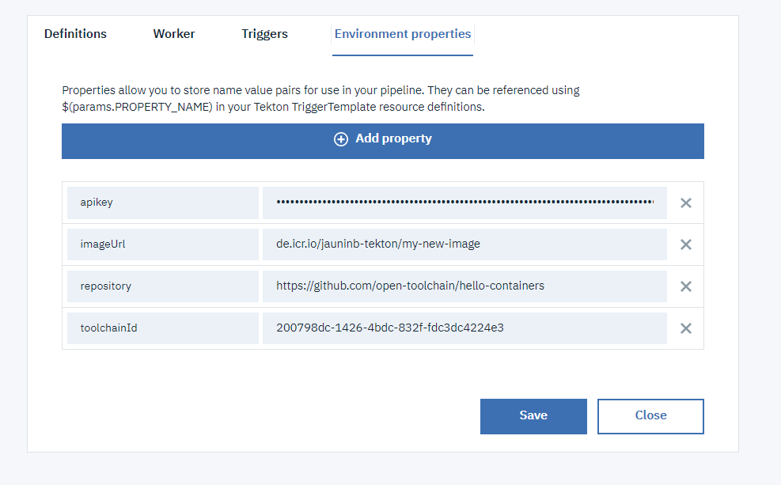

# Build Image task helper

This task is building and pushing an image to IBM Cloud Container Registry. This taks is relying on [Buildkit](https://github.com/moby/buildkit) to perform the build of the image.

**WARNING: This task needs to run on Kubernetes cluster with minimal version 1.15. If you are using your own Delivery Pipeline Private Worker to run your tekton pipeline(s), ensure your cluster is updated to this version at least.**

## Install the Task
- Add a github integration in your toolchain to the repository containing the task (https://github.com/open-toolchain/tekton-catalog)
- Add that github integration to the Definitions tab of your Continuous Delivery tekton pipeline, with the Path set to `container-registry`

## Inputs

### Context - ConfigMap/Secret

  The task expects the following kubernetes resources to be defined:

* **ConfigMap cd-config**

  ConfigMap corresponding to the CD tekton pipeline context:
  * **API**: IBM Cloud api endpoint. 
  * **TOOLCHAIN_ID**: Id of the toolchain
  * **REGION**: Region where the toolchain is defined

  See [sample TriggerTemplate](./sample/listener-containerize.yaml) on how to create the configMap using `resourcetemplates` in a `TriggerTemplate`

* **Secret cd-secret**

  Secret containing:
  * **API_KEY**: An IBM Cloud Api Key allowing access to the toolchain (https://cloud.ibm.com/iam/apikeys)

  See [sample TriggerTemplate](./sample/listener-containerize.yaml) on how to create the secret using `resourcetemplates` in a `TriggerTemplate`

### Parameters

* **task-pvc**: the output pvc - this is the name of the PVC that is mounted for the execution of the task
* **pathToContext**: (optional) the path to the context that is used for the build (default to `.` meaning current directory)
* **pathToDockerfile**: (optional) the path to the Dockerfile that is used for the build (default to `.` meaning current directory)
* **buildkit_image**: (optional) The name of the BuildKit image used (default to `moby/buildkit:v0.6.3-rootless`)
* **directoryName**: (optional) name of the new directory to clone into (default to `.` in order to clone at the root of the volume mounted for the pipeline run). Note: It will be to the "humanish" part of the repository if this param is set to blank
* **additionalTags**: (optional) comma-separated list of tags for the built image
* **additionalTagsScript**: (optional) Shell script commands that will be invoked to provide additional tags for the build image
* **propertiesFile**: (optional) name of the properties file that will be created (if needed) or updated (if existing) as an additional outcome of this task in the pvc. This file will contains the image registry-related information (`REGISTRY_URL`, `REGISTRY_NAMESPACE`, `REGISTRY_REGION`, `IMAGE_NAME`, `IMAGE_TAGS` and `IMAGE_MANIFEST_SHA`)

## Outputs

### Resources

* **builtImage**: The Image PipelineResource that will be created as output of this task.

## Usage
The `sample` sub-directory contains an EventListener definition that you can include in your tekton pipeline configuration to run an example of the `containerize-task`.

**Note:** This sample also rely on the clone-repo task to clone the application to containerize.

1) Create a toolchain (or update a toolchain) to include:

   - the git repository that you want to clone, which can be private
   - the repository containing this tekton task
   - a tekton pipeline definition

   

2) Add the definitions:

   - for the `clone-repo-task` (`git` path)
   - for this task and the sample (`container-registry` and `container-registry/sample` paths)

   

3) Add the environment properties:

   - `toolchainId`, `apikey` (and optionally `toolchainRegion` if the toolchain is not in `us-south`) to inject Continuous Delivery toolchain context
   - `repository` to indicate the git repository url to clone (correspoding to the one integrated in the toolchain)
   - `imageUrl` to indicate the URL of the image to push to the IBM Cloud Container Registry

   

4) Create a manual trigger to start the sample listener

   

5) Run the pipeline

6) After the pipeline ran successfully, if you look at the IBM Cloud container registry content referenced within the Image url definition, you will see an image with the expected tags:
   ```
   $ ibmcloud cr images
   Listing images...

   Repository                                 Tag                                                     Digest         Namespace        Created          Size    Security status
   de.icr.io/jauninb-tekton/my-second-image   1.0.0-dev                                               97c251e54286   jauninb-tekton   31 minutes ago   54 MB   No Issues
   de.icr.io/jauninb-tekton/my-second-image   1.0.0-master-e8e9fa6b7827d7898d04a218fa69f327db7fc2b4   97c251e54286   jauninb-tekton   31 minutes ago   54 MB   No Issues
   de.icr.io/jauninb-tekton/my-second-image   latest                                                  97c251e54286   jauninb-tekton   31 minutes ago   54 MB   No Issues

   OK
   ```
