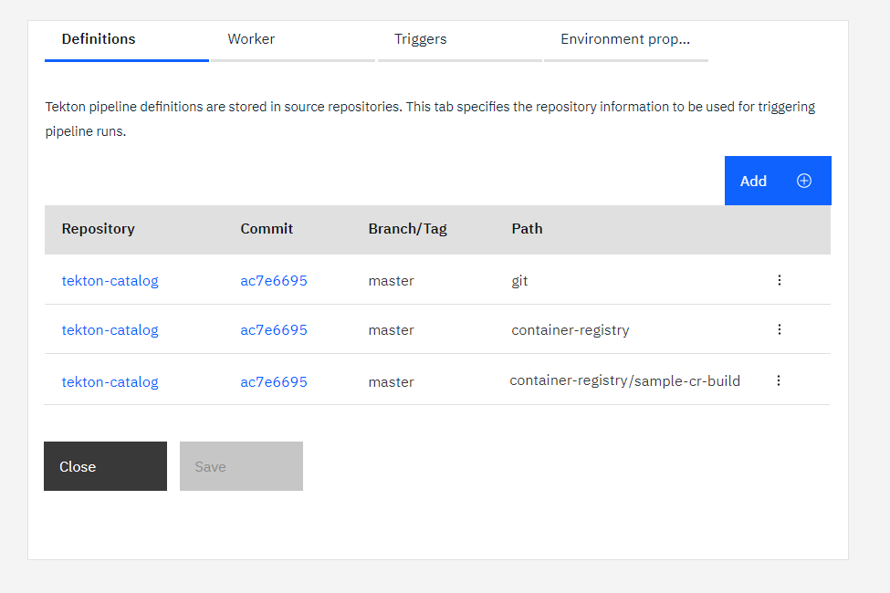
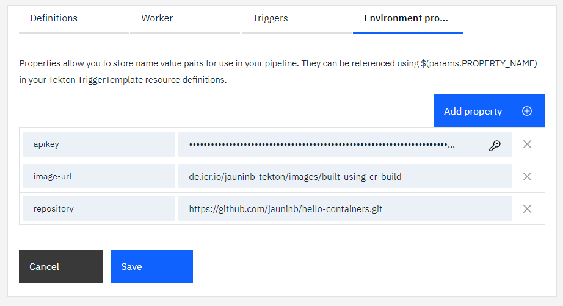
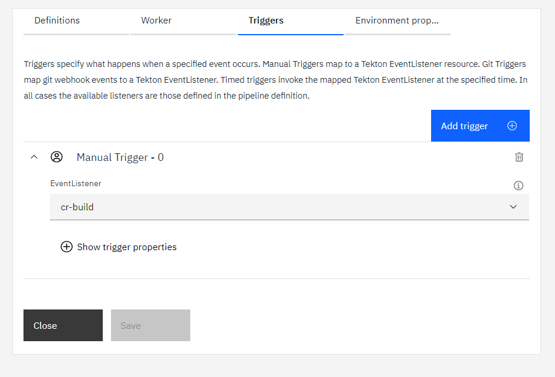

# Container-Registry Build Task example usage
The `sample-cr-build` sub-directory contains an `cr-build` EventListener definition that you can include in your tekton pipeline configuration to run an example usage of the `cr-build-task` and `vulnerability-advisor-task`.

**Note:** this sample also relies on the clone-repo task to clone the application to containerize.

1) Create or update a toolchain to include:

   - the git repository that you want to clone, which can be private
   - the repository containing this tekton task
   - a [Tekton pipeline definition](https://cloud.ibm.com/docs/ContinuousDelivery?topic=ContinuousDelivery-tekton-pipelines#create_tekton_pipeline)

   

2) Add the definitions:

   - for the `clone-repo-task` (`git` path)
   - for this task and the sample (`container-registry` and `container-registry/sample-cr-build` paths)

   

3) Add the environment properties:

   - `apikey` to provide an API key used for the ibmcloud login/access
   - `repository` to indicate the git repository url to clone (correspoding to the one integrated in the toolchain)
   - `imageUrl` to indicate the URL of the image to push to the IBM Cloud Container Registry

   

4) Create a manual trigger to start the sample listener

   

5) Run the pipeline

6) After the pipeline ran successfully, if you look at the IBM Cloud container registry content referenced within the Image url definition, you will see an image with the expected tags:
   ```
   $ ibmcloud cr images --restrict jauninb-tekton
   Listing images...

   Repository                                                 Tag                                                     Digest         Namespace        Created       Size    Security status
   de.icr.io/jauninb-tekton/images/built-using-cr-build       1.0.0-9                                                 6ebe29100f2e   jauninb-tekton   1 hour ago    55 MB   No Issues
   de.icr.io/jauninb-tekton/images/built-using-cr-build       1.0.0-master-e8e9fa6b7827d7898d04a218fa69f327db7fc2b4   6ebe29100f2e   jauninb-tekton   1 hour ago    55 MB   No Issues
   de.icr.io/jauninb-tekton/images/built-using-cr-build       latest                                                  6ebe29100f2e   jauninb-tekton   1 hour ago    55 MB   No Issues

   OK
   ```
