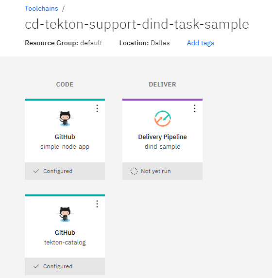
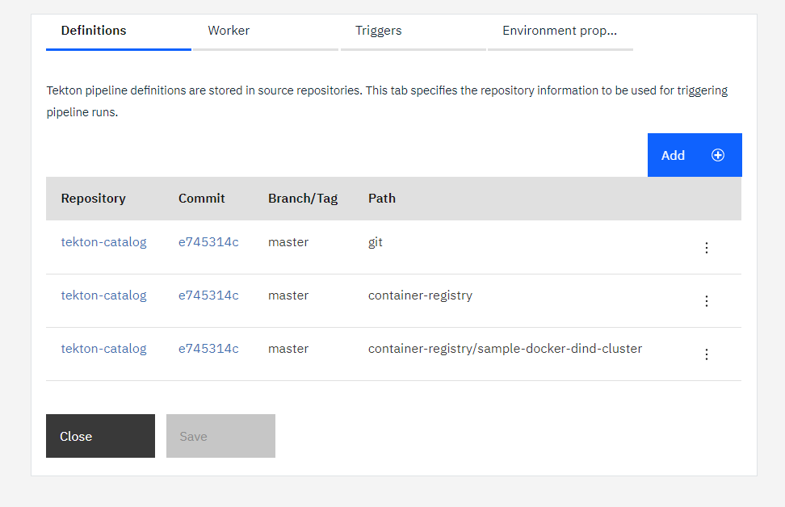
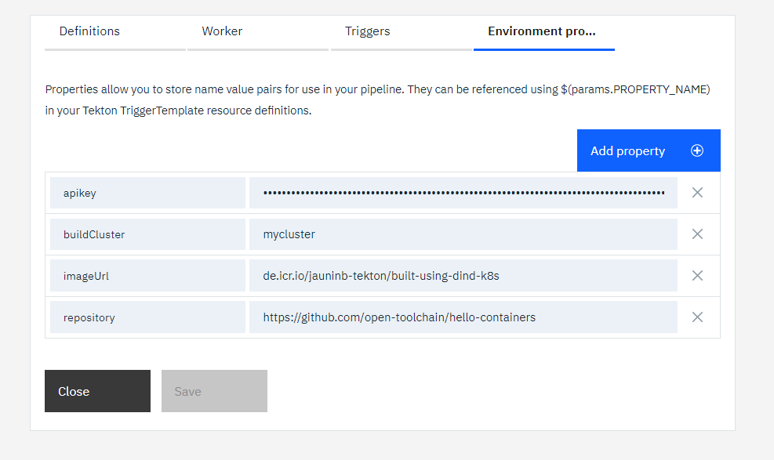
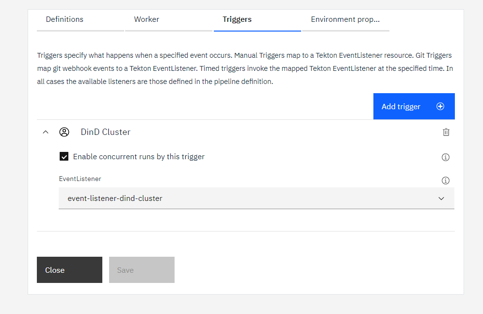
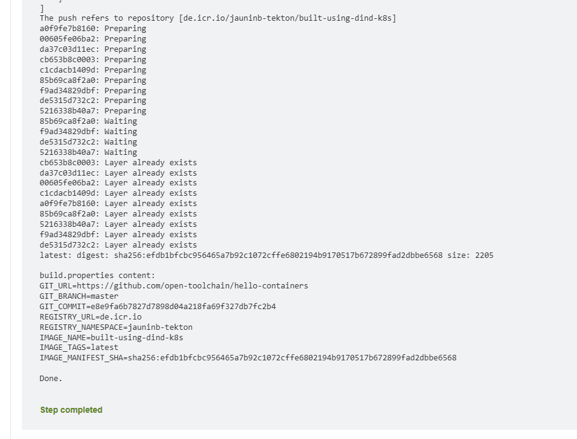

# Docker In Docker (DIND) Kubernetes Cluster Hosted task example usage
The `sample-docker-dind-cluster` sub-directory contains an `dind-cluster-no-resources` EventListener definition that you can include in your Tekton pipeline configuration to run an example usage of the `icr-execute-in-dind-cluster` and `icr-check-va-scan`. This pipeline definition uses the task's parameter `image-url` to provide the information on image to build and scan.

**Note:** this sample also relies on the clone-repo task to clone the application to containerize.

1) Create or update a toolchain to include:

   - the git repository that you want to clone, which can be private
   - the repository containing this Tekton task
   - a [Tekton pipeline definition](https://cloud.ibm.com/docs/ContinuousDelivery?topic=ContinuousDelivery-tekton-pipelines#create_tekton_pipeline)

   

2) Add the definitions:

   - for the `git-clone-repo` (`git` path)
   - for this task and the sample (`container-registry` and `container-registry/sample-docker-dind-cluster` paths)

   

3) Add the environment properties:

   - `apikey` to provide an API key used for the ibmcloud login/access
   - `build-cluster` to provide the kubernetes cluster name that will be used as a build cluster (ie hosting the Docker DinD)
   - `image-url` to indicate the URL of the image to push to the IBM Cloud Container Registry
   - `repository` to indicate the git repository url to clone (correspoding to the one integrated in the toolchain)

   

4) Create a manual trigger to start the sample listener

   

5) Run the pipeline

6) Verify that the image was build and pushed by looking at the pipeline run execution log:

   

## Detailed Description

This pipeline and relevant trigger(s) can be configured using the properties described below.

See https://cloud.ibm.com/docs/ContinuousDelivery?topic=ContinuousDelivery-tekton-pipelines&interface=ui#configure_tekton_pipeline for more information.

### dind-cluster-no-resources

**EventListener**: dind-cluster-no-resources

| Properties | Description | Default | Required | Type |
|------------|-------------|---------|----------|------|
| `apikey` (**secured property**) | [IBM Cloud Api Key](https://cloud.ibm.com/iam/apikeys) used to access to the toolchain (and git intergation toolcard like `Git Repos and Issue Tracking` service if used). | - | Yes | secret |
| `branch` | the branch for the git repo | `master` | No | string |
| `build-cluster` | name of the cluster that will host the docker dind to build docker images | - | Yes | string |
| `cluster-name` | name of the docker build cluster | - | Yes | string |
| `image-url` | the url of the image to build | - | Yes | string |
| `pipeline-debug` | Pipeline debug mode. Value can be 0 or 1. | `0` | No | string |
| `properties-file` | name of the properties file that will be created (if needed) or updated (if existing) as an additional outcome of this task in the workspace. This file will contains the git related information (`GIT_URL`, `GIT_BRANCH` and `GIT_COMMIT`) and image registry-related information (`REGISTRY_URL`, `REGISTRY_NAMESPACE`, `REGISTRY_REGION`, `IMAGE_NAME`, `IMAGE_TAGS` and `IMAGE_MANIFEST_SHA`) | - | Yes | string |
| `repository` | the git repo | - | Yes | string |
