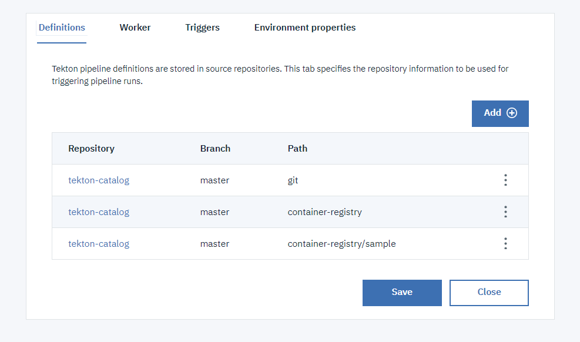
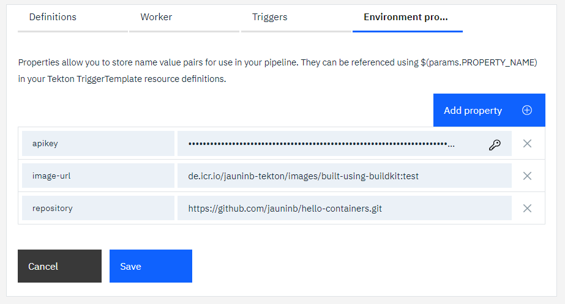

# Containerize Task example usage
The `sample` sub-directory contains an `event-listener-container-registry` EventListener definition that you can include in your tekton pipeline configuration to run an example usage of the `icr-containerize` and `icr-check-va-scan`.

It also contains a `buildkit-no-resources` EventListener definition which is the providing the same example but without the needs to define PipelineResources for image as it uses the task's parameter `image-url` to provide the information.

It also contains a `buildkit-no-image-url` EventListener definition which is the providing the same example but without the needs to define PipelineResources for image, neither parameter `image-url`. The information on the IBM Cloud container registry and image to build is provided using parameters `registry-region`, `registry-namespace` and `image-name`.

**Note:** this sample also relies on the clone-repo task to clone the application to containerize.

1) Create or update a toolchain to include:

   - the git repository that you want to clone, which can be private
   - the repository containing this tekton task
   - a [Tekton pipeline definition](https://cloud.ibm.com/docs/ContinuousDelivery?topic=ContinuousDelivery-tekton-pipelines#create_tekton_pipeline)

   

2) Add the definitions:

   - for the `git-clone-repo` (`git` path)
   - for this task and the sample (`container-registry` and `container-registry/sample` paths)

   

3) Add the environment properties:

   - `apikey` to provide an API key used for the ibmcloud login/access
   - `repository` to indicate the git repository url to clone (correspoding to the one integrated in the toolchain)
   - `image-url` to indicate the URL of the image to push to the IBM Cloud Container Registry

   

4) Create a manual trigger to start the sample listener

   

5) Run the pipeline

6) After the pipeline ran successfully, if you look at the IBM Cloud container registry content referenced within the Image url definition, you will see an image with the expected tags:
   ```
    $ ibmcloud cr images
    Listing images...

    Repository                              Tag                                                     Digest         Namespace        Created         Size    Security status
    de.icr.io/jauninb-tekton/my-new-image   1.0.0-dev                                               5107dea95bd0   jauninb-tekton   6 minutes ago   54 MB   No Issues
    de.icr.io/jauninb-tekton/my-new-image   1.0.0-master-e8e9fa6b7827d7898d04a218fa69f327db7fc2b4   5107dea95bd0   jauninb-tekton   6 minutes ago   54 MB   No Issues

    OK
   ```
