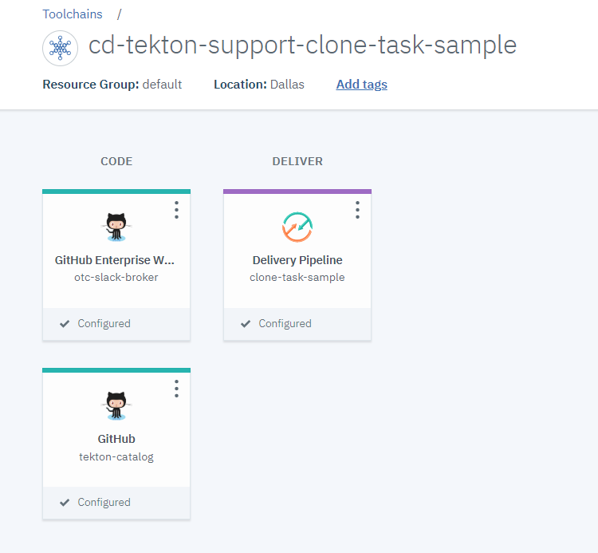
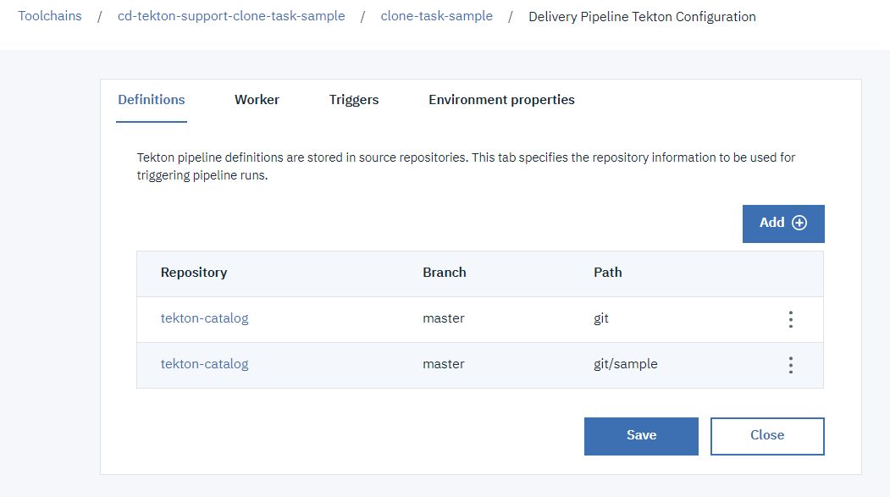
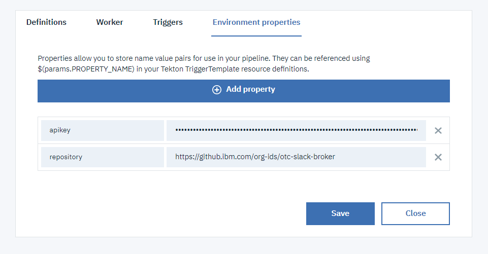

# Git integration clone task helper

This Task fetches the credentials needed to perform a git clone of a repo specified by a [Continuous Delivery toolchain](https://cloud.ibm.com/docs/services/ContinuousDelivery?topic=ContinuousDelivery-toolchains-using) and then uses them to clone the repo.

## Install the Task
- Add a github integration in your toolchain to the repository containing the task (https://github.com/open-toolchain/tekton-catalog)
- Add that github integration to the Definitions tab of your Continuous Delivery tekton pipeline, with the Path set to `git`

## Inputs

### Context - ConfigMap/Secret

  The task expects the following kubernetes resource to be defined:

* **Secret cd-secret**

  Secret containing:
  * **API_KEY**: An IBM Cloud Api Key allowing access to the toolchain (and `Git Repos and Issue Tracking` service if used)

  See [sample TriggerTemplate](./sample/listener-simple-clone.yaml) on how to create the secret using `resourcetemplates` in a `TriggerTemplate`

### Parameters

* **task-pvc**: the output pvc - this is where the cloned repository will be stored
* **repository**: the git repository url that the toolchain is integrating
* **branch**: the git branch (default value to `master`)
* **revision**: (optional) the git revision/commit to update the git HEAD to (default to empty meaning only use the branch information)
* **directoryName**: (optional) name of the new directory to clone into (default to `.` in order to clone at the root of the volume mounted for the pipeline run). Note: It will be to the "humanish" part of the repository if this param is set to blank
* **propertiesFile**: (optional) name of the properties file that will be created as an additional outcome of this task in the pvc. This file will contains the git related information (`GIT_URL`, `GIT_BRANCH` and `GIT_COMMIT`)
* **resourceGroup**: (optional) target resource group (name or id) for the ibmcloud login operation

## Outputs
The output of this task is the repository cloned into the directory on the pvc.

## Usage
The `sample` sub-directory contains an EventListener definition that you can include in your tekton pipeline configuration to run an example of the `clone-repo-task`

1) Create a toolchain (or update a toolchain) to include:

   - the git repository that you want to clone, which can be private
   - the repository containing this tekton task
   - a tekton pipeline definition

   

2) Add the definitions of this task and the sample (`git` and `git/sample` paths)

   

3) Add the environment properties:

   - `apikey` to provide an API key used for the ibmcloud login/access
   - `repository` to indicate the git repository url to clone (correspoding to the one integrated in the toolchain)

   

4) Create a manual trigger to start the sample listener

   

5) Run the pipeline
