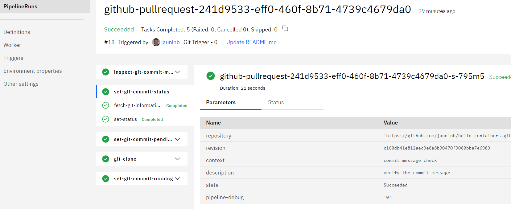

## Git Pull Request event trigger with set PR/MR commit status ##

This `sample-git-pr-status` sub-directory contains several EventListener definitions that you can include in your CD tekton pipeline configuration to run an example demonstrating the usage of the `git-set-commit-status` in the context of a CD Tekton pipeline triggered by a Git Pull Request event (PullRequest push/update).

This sample illustrates the PullRequest support provided by the `git-clone-repo` that results in a Git repository content that would be identical to the one obtained after a merge action on the given PullRequest (or Merge Request for a Gitlab or GRIT server).

It is also showcase the `git-set-commit-status`to create/update Pull Request status check (i.e. set commit status on the last commit of the Pull Request).
The status being sucess or failing according to the commit message (it the commit message contains `fail` then the status is `failed` otherwise it is `success`)

1) Create or update a Toolchain to include:

   - the github.com repository that you want to clone
   - (optional) the GRIT repository that you want to clone
   - (optional) the BitBucket repository that you want to clone
   - the repository containing this Tekton task
   - a Tekton pipeline definition

   

2) Add the definitions of this task and the sample (`git` and `git/sample-git-pr-status` paths)

   

3) Add the environment properties:

   - `apikey`: the API key used for the ibmcloud login/access

   

4) Create Git Triggers for the different Git repositories that you have integrated to your Toolchain (corresponding to the repositories integrated to your Toolchain).
   
   Github:
    - `eventlistener-git-trigger-github-pr` for Github PullRequest opened/updated event

      

   GRIT/Gitlab:
    - `eventlistener-git-trigger-grit-mr` for GRIT/Gitlab MergeRequest opened/updated event

   BitBucket:
    - `eventlistener-git-trigger-bitbucket-pr` for BitBucket PullRequest opened/updated event

5) **Trigger on PullRequest**: in one of your repository that has the above triggers defined, define a new Git branch, push some code changes and create a new PullRequest to the default `master` branch.

   

   

   Observe: a new pipeline run is automatically started, triggered by this PullRequest.

   

   Notes:
   - The `clone-task` execution will produce the same repository content as the "Merge Pull Request" action/button would.
   - The `set-git-commit-status` task execution will use the `inspect-git-commit-message` pipelinerun task execution status to update the PullRequest commit status

   

   The Pull Request status check is updated as the last commit has a commit status

   

   Note: in case of a commit message containing `fail` the task will result in a failure and the `finally` clause in the pipeline definition will still execute the `set-git-commit-status` task with the appropriate state

   

   The Pull Request status check is updated to failure corresponding to the last commit status

   
