## Git event trigger with clone task sample usage ##

This `sample-git-trigger` sub-directory contains several EventListener definitions that you can include in your CD tekton pipeline configuration to run an example showing usage of the `clone-repo-task` in the context of CD tekton pipeline triggered by git event (Commit push or PullRequest push/update)

This sample illustrates the PullRequest support provided by the `git-clone-task` to obtain git repository content that would be the same as what you would obtain after a merge action on the given PullRequest (or Merge Request for a Gitlab or GRIT server)

1) Create a toolchain (or update a toolchain) to include:

   - a github.com repository that you want to clone
   - (optional) a GRIT repository that you want to clone
   - (optional) a BitBucket repository that you want to clone
   - the repository containing this tekton task
   - a tekton pipeline definition

   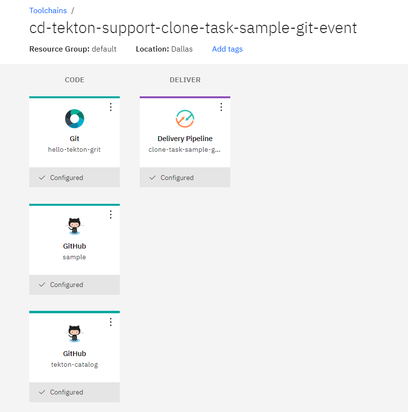

2) Add the definitions of this task and the sample (`git` and `git/sample-git-trigger` paths)

   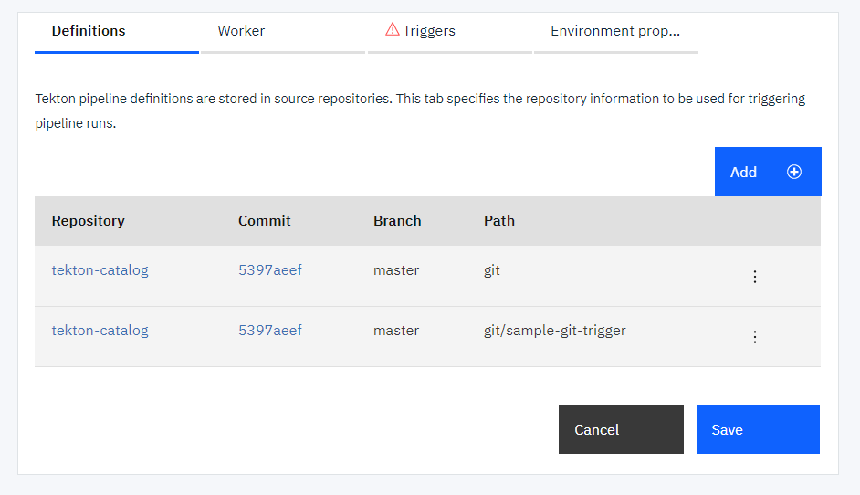

3) Add the environment properties:

   - `apikey` to provide an API key used for the ibmcloud login/access
   - `repositoryForManualTrigger` to indicate the git repository url to clone (correspoding to the one integrated in the toolchain) when using the ManualTrigger

   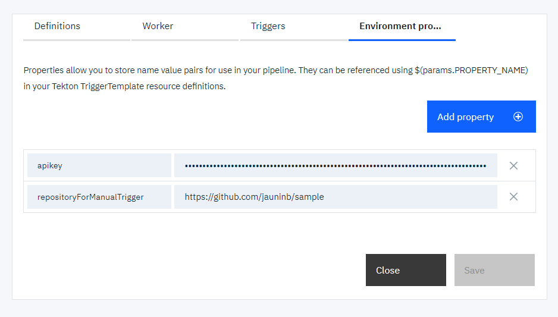

4) Create a manual trigger to manually start the `event-listener-pr-processing-manual` listener

   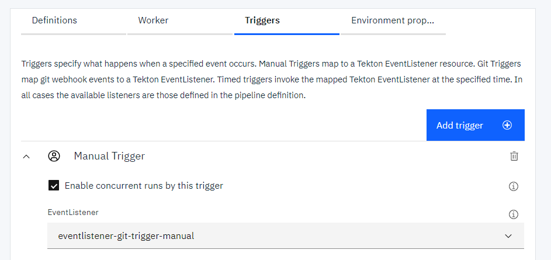

5) Run the pipeline by starting the Manual Trigger 

   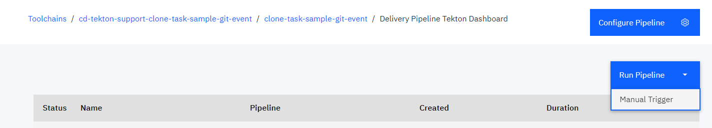

   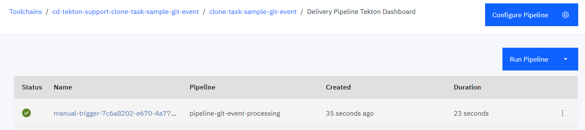

6) Check the logs of the pipeline run execution

   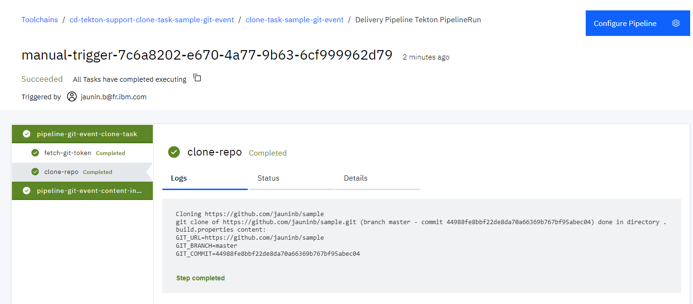

7) Create Git Triggers for the different git repositories that you have integrated in your toolchain (according to the repositories you have integrated in your toolchain)
   
   Github:
    - `event-listener-pr-processing-github-commit-event` for Github Commit pushed event

      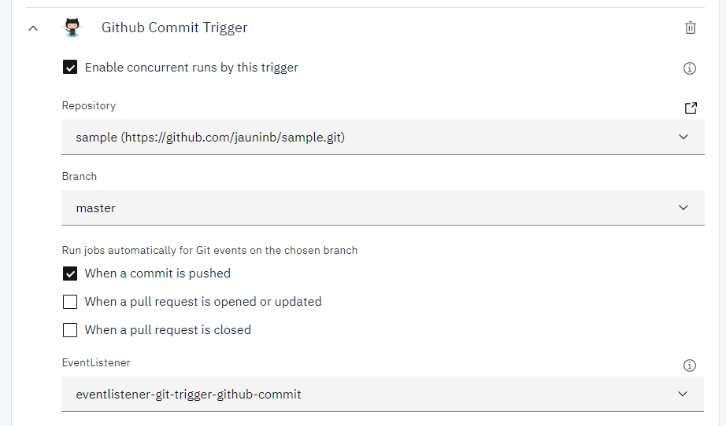

    - `event-listener-pr-processing-github-pr-event` for Github PullRequest opened/updated event

      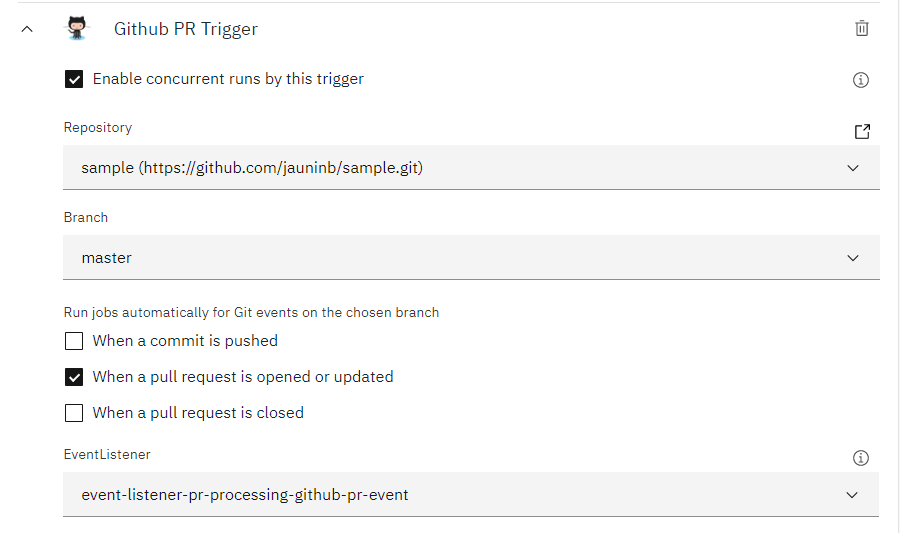

   GRIT/Gitlab:
    - `event-listener-pr-processing-grit-commit-event` for GRIT/Gitlab Commit pushed event
    - `event-listener-pr-processing-grit-pr-event` for GRIT/Gitlab MergeRequest opened/updated event

   BitBucket:
    - `event-listener-pr-processing-bitbucket-commit-event` for BitBucket Commit pushed event
    - `event-listener-pr-processing-bitbucket-pr-event` for BitBucket PullRequest opened/updated event

8) Update the code in one of the repository which has trigger defined using your tool and environnement of your choice.
  
   ```
   $ git clone https://github.com/jauninb/sample.git
   Cloning into 'sample'...

   $ cd sample

   $ touch new-file-there

   $ git add .

   $ git commit -m "Add a new file"
   [master 309fde4] Add a new file
   1 file changed, 0 insertions(+), 0 deletions(-)
   create mode 100644 new-file-there

   $ git push origin master
   Enumerating objects: 3, done.
   Counting objects: 100% (3/3), done.
   To https://github.com/jauninb/sample.git
      44988fe..309fde4  master -> master
   ```

   You will see a corresponding pipeline run started

   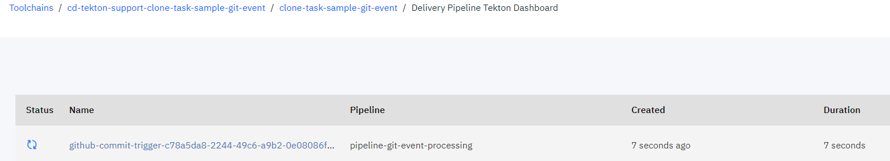

9) In one of your repository which has trigger defined, define a new git branch, push some code changes and create a PullRequest to the default `master` branch

   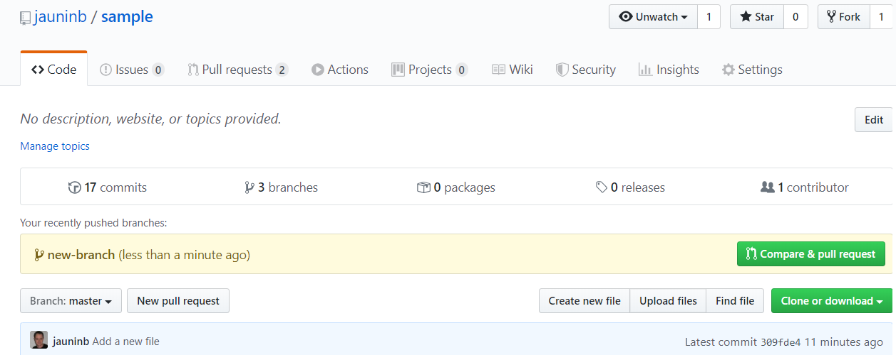

   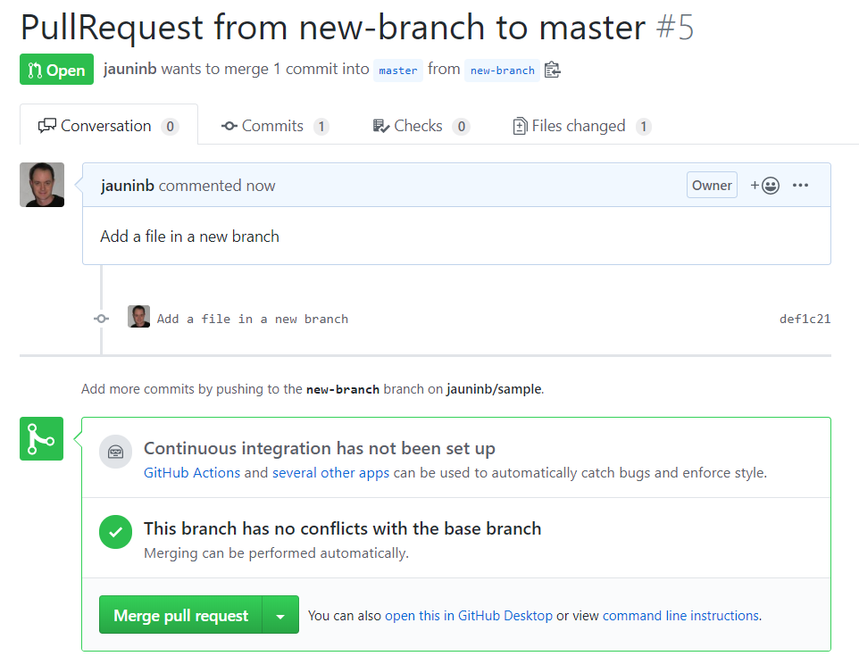

   You will see a corresponding pipeline run started

   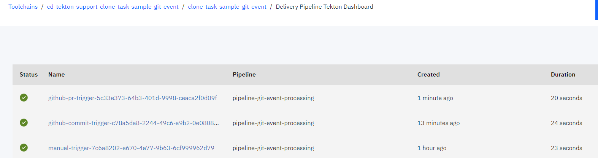

   Note: The clone-task execution will produce the same repository content as the "Merge Pull Request" action/button would do

   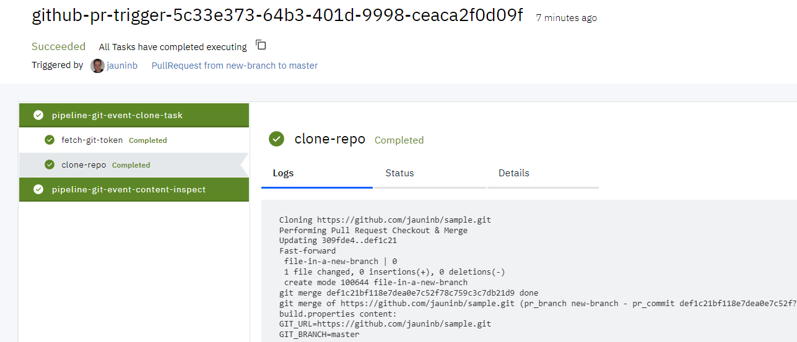


   Note: If you have a PullRequest that have conflict, the pipeline run will fail because the merge can not be made automatically

   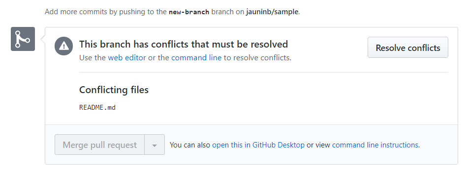

   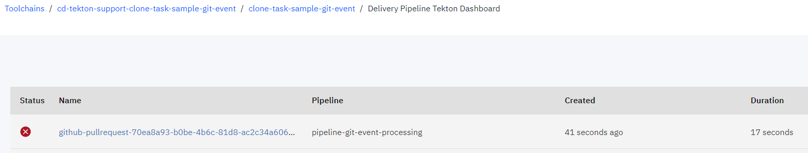

   Note: The `clone-task` task run will have a failure in the `clone-repo` step execution

   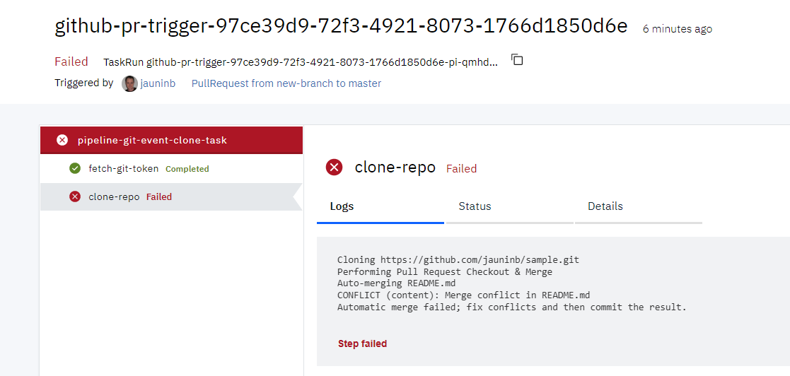
