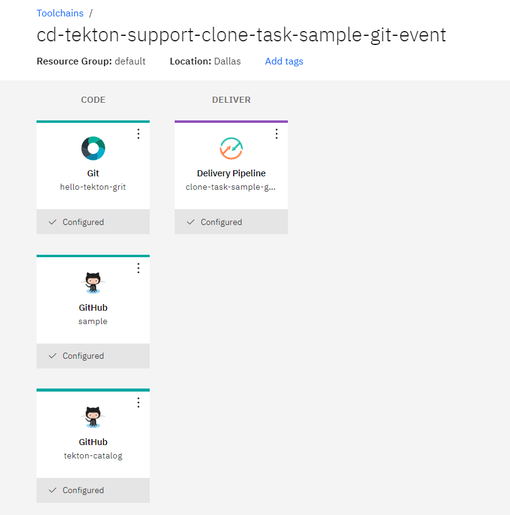
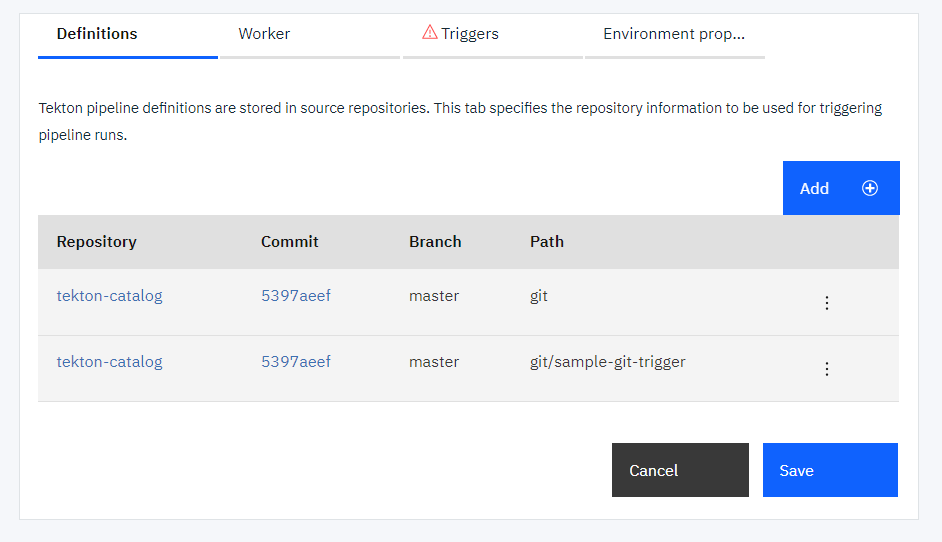
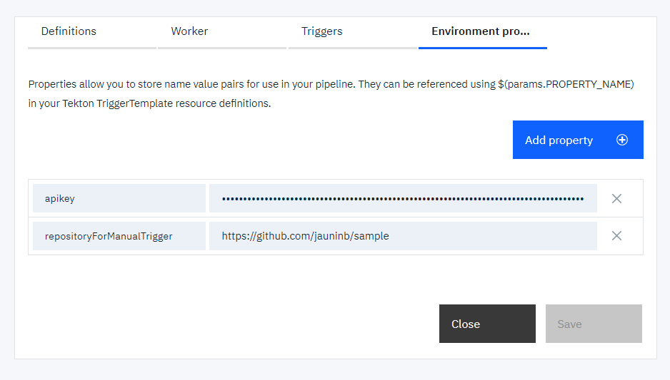
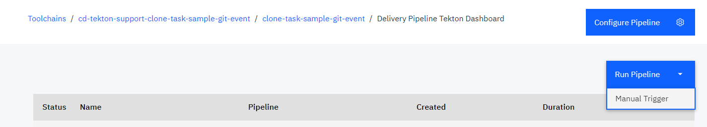
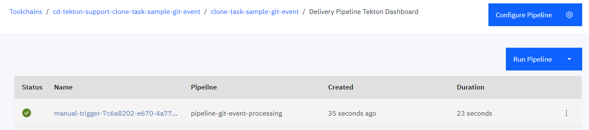
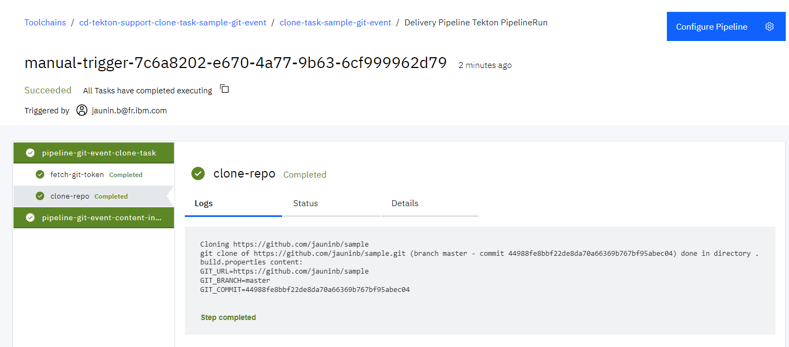

## Git event trigger with clone task sample usage ##

This `sample-git-trigger` sub-directory contains several EventListener definitions that you can include in your CD tekton pipeline configuration to run an example showing usage of the `clone-repo-task` in the context of CD tekton pipeline triggered by git event (Commit push or PullRequest push/update)

This sample illustrates the PullRequest support provided by the `git-clone-task` to obtain git repository content that would be the same as what you would obtain after a merge action on the given PullRequest (or Merge Request for a Gitlab or GRIT server)

1) Create a toolchain (or update a toolchain) to include:

   - a github.com repository that you want to clone
   - (optional) a GRIT repository that you want to clone
   - (optional) a BitBucket repository that you want to clone
   - the repository containing this tekton task
   - a tekton pipeline definition

   

2) Add the definitions of this task and the sample (`git` and `git/sample-git-trigger` paths)

   

3) Add the environment properties:

   - `apikey` to provide an API key used for the ibmcloud login/access
   - `repositoryForManualTrigger` to indicate the git repository url to clone (correspoding to the one integrated in the toolchain) when using the ManualTrigger

   

4) Create a manual trigger to manually start the `event-listener-pr-processing-manual` listener

   

5) Run the pipeline by starting the Manual Trigger 

   

   

6) Check the logs of the pipeline run execution

   

