## Git event trigger with clone task sample usage ##

This `sample-git-trigger` sub-directory contains several EventListener definitions that you can include in your CD tekton pipeline configuration to run an example demonstrating the usage of the `git-clone-repo` in the context of a CD Tekton pipeline triggered by a Git event (Commit push or PullRequest push/update).

This sample illustrates the PullRequest support provided by the `git-clone-repo` (il n'y a pas de git-clone task, correct?) that results in a Git repository content that would be identical to the one obtained after a merge action on the given PullRequest (or Merge Request for a Gitlab or GRIT server).

1) Create or update a Toolchain to include:

   - the github.com repository that you want to clone
   - (optional) the GRIT repository that you want to clone
   - (optional) the BitBucket repository that you want to clone
   - the repository containing this Tekton task
   - a Tekton pipeline definition

   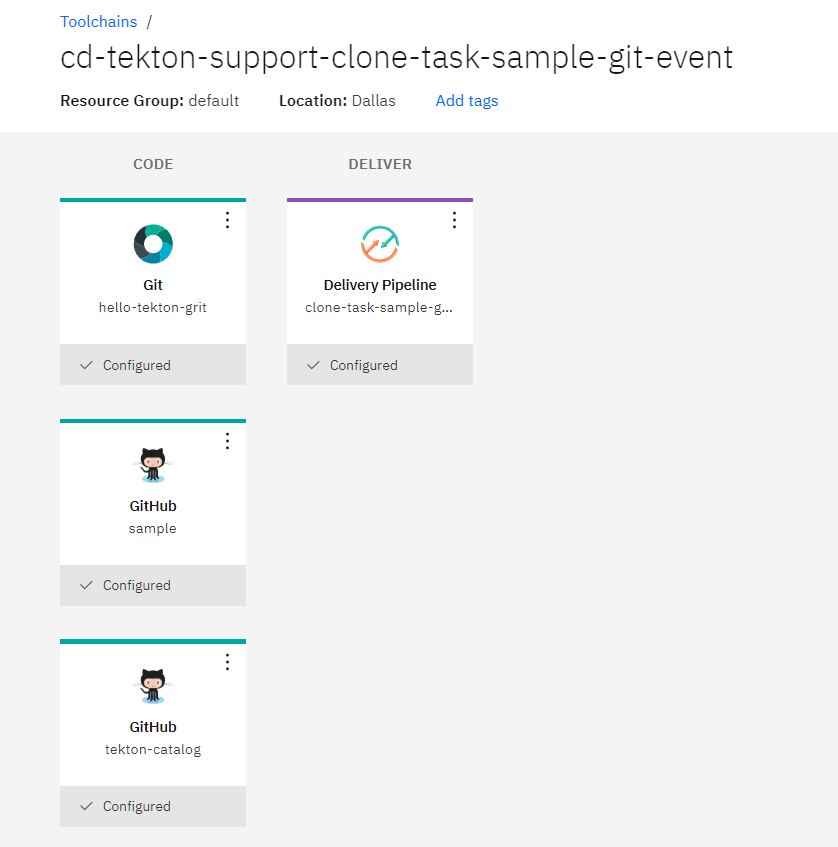

2) Add the definitions of this task and the sample (`git` and `git/sample-git-trigger` paths)

   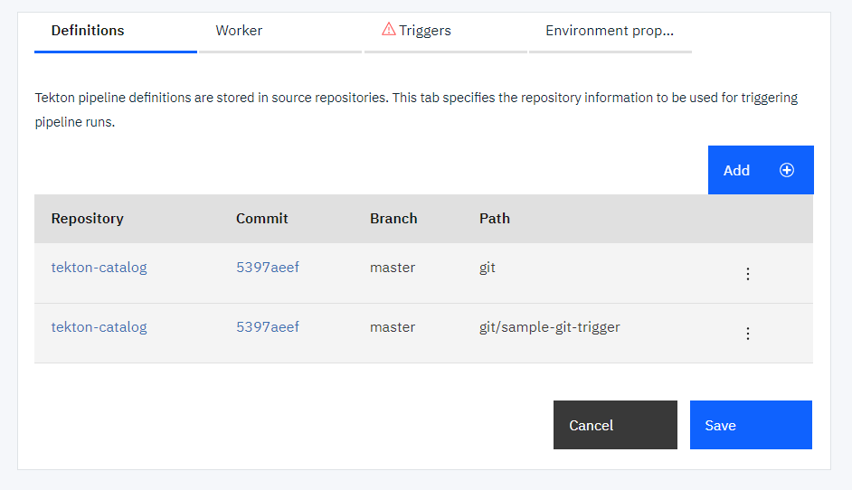

3) Add the environment properties:

   - `apikey`: the API key used for the ibmcloud login/access
   - `repositoryForManualTrigger`: the URL of the Git repository to clone (corresponding to the one integrated in the Toolchain) when using the ManualTrigger.

   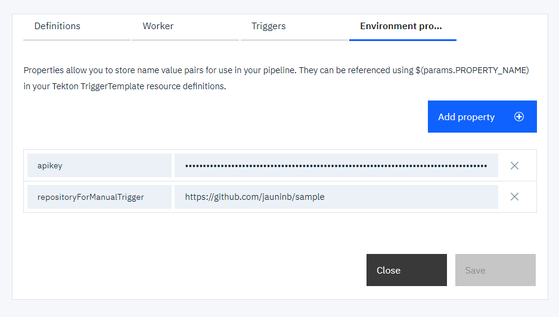

4) Create a manual trigger to manually start the `event-listener-pr-processing-manual` listener.

   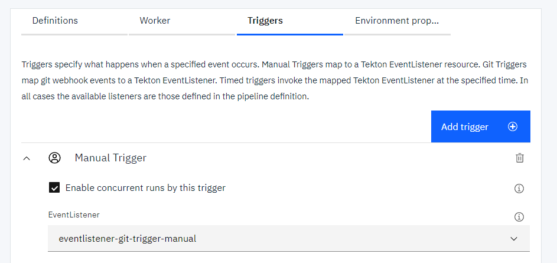

5) Run the pipeline by starting the Manual Trigger.

   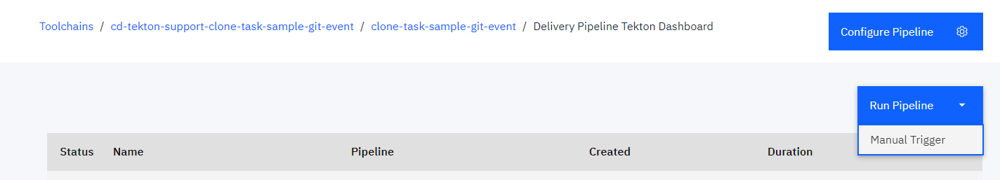

   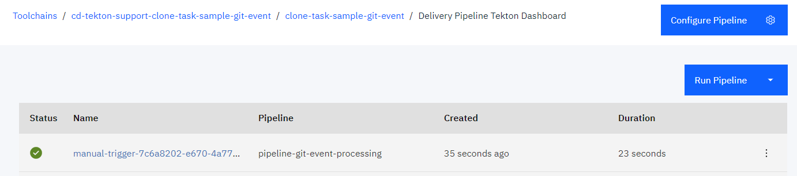

6) Check the logs of the pipeline run execution.

   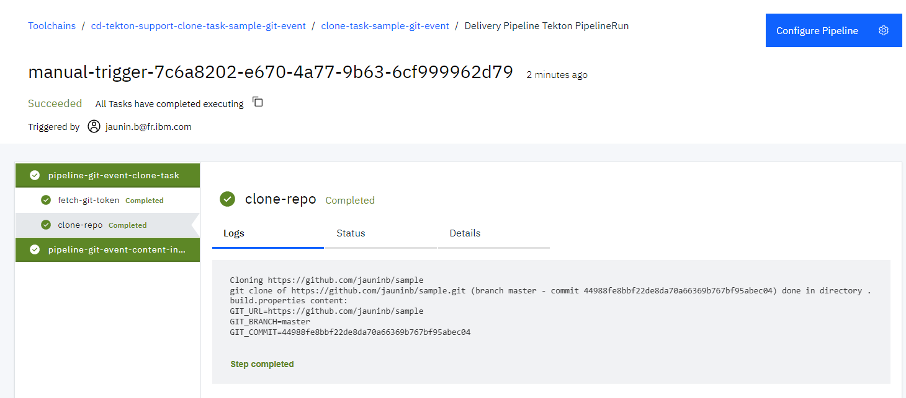

7) Create Git Triggers for the different Git repositories that you have integrated to your Toolchain (corresponding to the repositories integrated to your Toolchain).

   Github:
    - `eventlistener-git-trigger-github-commit` for Github Commit pushed event

      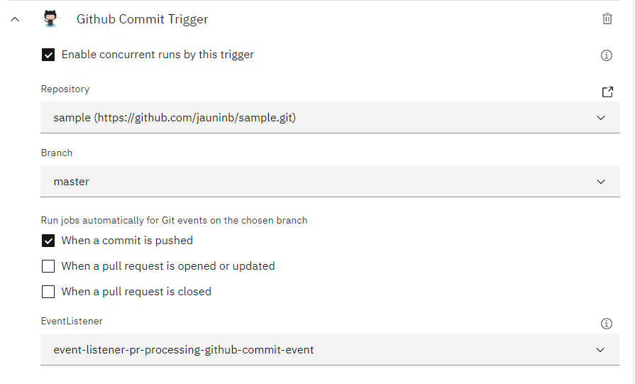

    - `eventlistener-git-trigger-github-pr` for Github PullRequest opened/updated event

      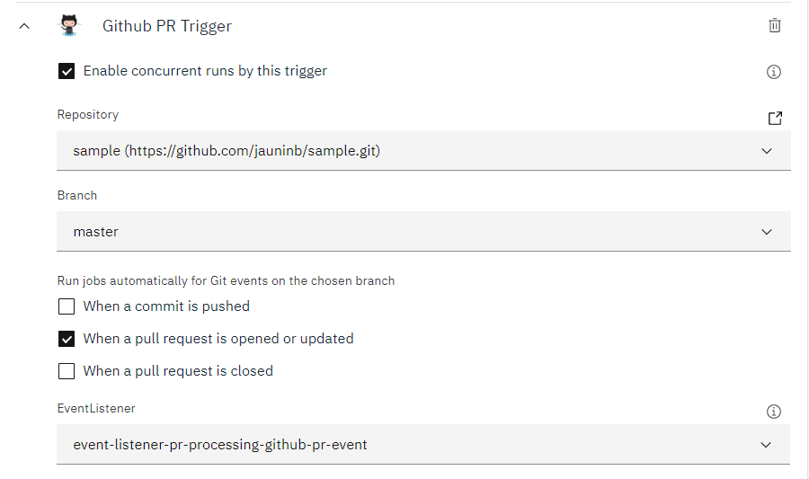

   GRIT/Gitlab:
    - `eventlistener-git-trigger-grit-commit` for GRIT/Gitlab Commit pushed event
    - `eventlistener-git-trigger-grit-mr` for GRIT/Gitlab MergeRequest opened/updated event

   BitBucket:
    - `eventlistener-git-trigger-bitbucket-commit` for BitBucket Commit pushed event
    - `eventlistener-git-trigger-bitbucket-pr` for BitBucket PullRequest opened/updated event

8) **Trigger on commit**: update the code in one of the repository that has the above triggers defined, using the tool and environment of your choice:

   ```
   $ git clone https://github.com/jauninb/sample.git
   Cloning into 'sample'...

   $ cd sample

   $ touch new-file-there

   $ git add .

   $ git commit -m "Add a new file"
   [master 309fde4] Add a new file
   1 file changed, 0 insertions(+), 0 deletions(-)
   create mode 100644 new-file-there

   $ git push origin master
   Enumerating objects: 3, done.
   Counting objects: 100% (3/3), done.
   To https://github.com/jauninb/sample.git
      44988fe..309fde4  master -> master
   ```

   Observe: a new pipeline run is automatically started, triggered by this commit.

   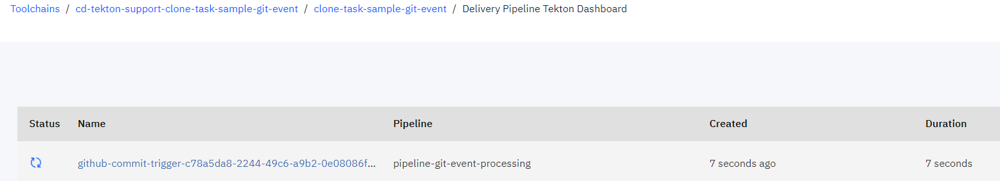

9) **Trigger on PullRequest**: in one of your repository that has the above triggers defined, define a new Git branch, push some code changes and create a new PullRequest to the default `master` branch.

   

   

   Observe: a new pipeline run is automatically started, triggered by this PullRequest.

   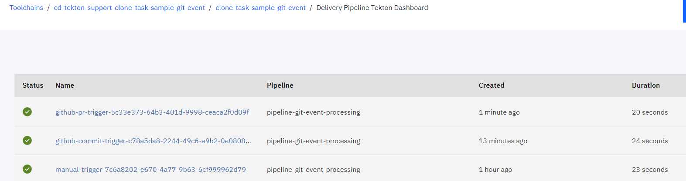

   Note: The clone-task execution will produce the same repository content as the "Merge Pull Request" action/button would.

   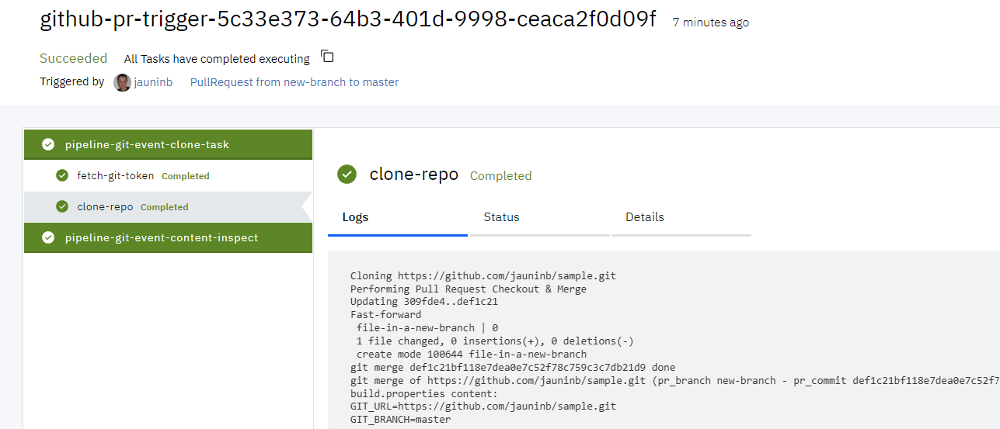


   Note: if a PullRequest can not be merged, due to conflict(s):

   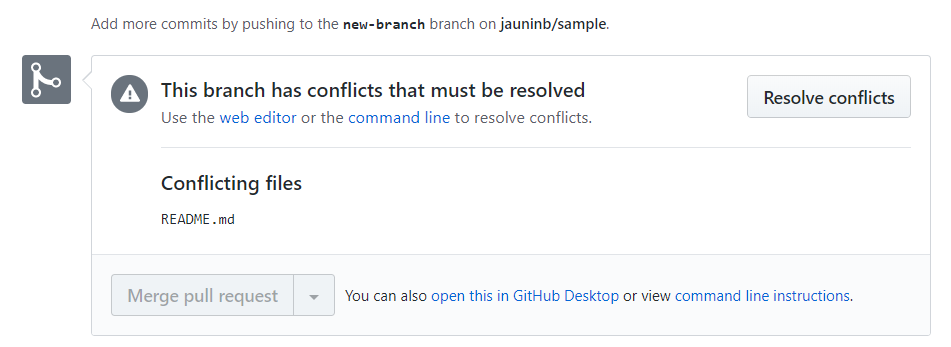

   Expect the corresponding pipeline run to fail, as the merge can not be made automatically:

   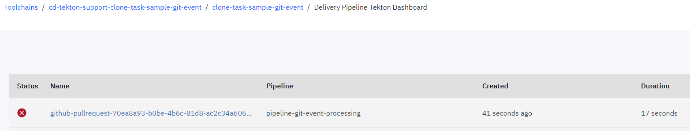

   Note: the `clone-task` task run fails during the `clone-repo` step execution:

   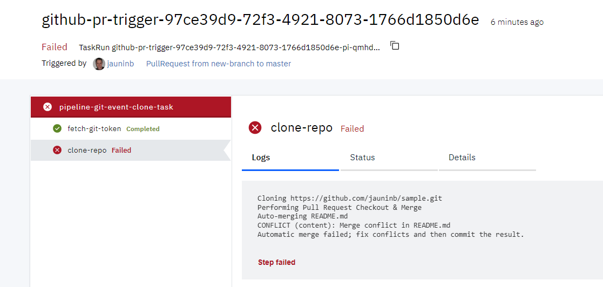

## Detailed Description

This pipeline and relevant trigger(s) can be configured using the properties described below.

See https://cloud.ibm.com/docs/ContinuousDelivery?topic=ContinuousDelivery-tekton-pipelines&interface=ui#configure_tekton_pipeline for more information.


**EventListeners:**

- [eventlistener-git-trigger-manual](#eventlistener-git-trigger-manual) - manual trigger for git sample
- [eventlistener-git-trigger-github-pr](#eventlistener-git-trigger-github-pr) - github pull-request listener for git sample
- [eventlistener-git-trigger-github-commit](#eventlistener-git-trigger-github-commit) - github commit push event listener for git sample
- [eventlistener-git-trigger-grit-mr](#eventlistener-git-trigger-grit-mr) - grit/gitlab merge-request listener for git sample
- [eventlistener-git-trigger-grit-commit](#eventlistener-git-trigger-grit-commit) - grit/gitlab commit push event listener for git sample
- [eventlistener-git-trigger-bitbucket-pr](#eventlistener-git-trigger-bitbucket-pr) - bitbucket pull-request listener for git sample
- [eventlistener-git-trigger-bitbucket-commit](#eventlistener-git-trigger-bitbucket-commit) - bitbucket git commit push event listener for git sample

### eventlistener-git-trigger-manual

**EventListener**: eventlistener-git-trigger-manual - manual trigger for git sample


| Properties | Description | Default | Required | Type |
|------------|-------------|---------|----------|------|
| `apikey` (**secured property**) | [IBM Cloud Api Key](https://cloud.ibm.com/iam/apikeys) used to access to the toolchain (and git intergation toolcard like `Git Repos and Issue Tracking` service if used). | - | Yes | secret |
| `branch` | the branch for the git repo | `master` | No | string |
| `directory-name` | name of the new directory to clone into. `.`means to clone at the root of the workspace. It will be set to the "humanish" part of the repository if this param is set to blank | `.` | No | string |
| `git-access-token` | the token to access the git repository for the clone operations | `` | No | string |
| `git-credentials-json-file` | - | `output/secrets/thecredentials.json` | No | string |
| `pipeline-debug` | Pipeline debug mode. Value can be 0 or 1. | `0` | No | string |
| `pr-branch` | The source branch for the PullRequest | `` | No | string |
| `pr-repository` | The source git repo for the PullRequest | `` | No | string |
| `pr-revision` | the commit id/sha for the PullRequest | `` | No | string |
| `properties-file` | - | `output/thebuild.properties` | No | string |
| `repository` | the git repo | `$(params.repositoryForManualTrigger)` | No | string |
| `revision` | the commit id/sha for the clone action | `` | No | string |
| `triggerName` | name of the trigger | `manual-trigger` | No | string |


### eventlistener-git-trigger-github-pr

**EventListener**: eventlistener-git-trigger-github-pr - github pull-request listener for git sample


| Properties | Description | Default | Required | Type |
|------------|-------------|---------|----------|------|
| `apikey` (**secured property**) | [IBM Cloud Api Key](https://cloud.ibm.com/iam/apikeys) used to access to the toolchain (and git intergation toolcard like `Git Repos and Issue Tracking` service if used). | - | Yes | secret |
| `branch` | the branch for the git repo | `$(event.pull_request.base.ref)` | No | string |
| `directory-name` | name of the new directory to clone into. `.`means to clone at the root of the workspace. It will be set to the "humanish" part of the repository if this param is set to blank | `.` | No | string |
| `git-access-token` | the token to access the git repository for the clone operations | `` | No | string |
| `git-credentials-json-file` | - | `output/secrets/thecredentials.json` | No | string |
| `pipeline-debug` | Pipeline debug mode. Value can be 0 or 1. | `0` | No | string |
| `pr-branch` | The source branch for the PullRequest | `$(event.pull_request.head.ref)` | No | string |
| `pr-repository` | The source git repo for the PullRequest | `$(event.pull_request.head.repo.clone_url)` | No | string |
| `pr-revision` | the commit id/sha for the PullRequest | `$(event.pull_request.head.sha)` | No | string |
| `properties-file` | - | `output/thebuild.properties` | No | string |
| `repository` | the git repo | `$(event.pull_request.base.repo.clone_url)` | No | string |
| `revision` | the commit id/sha for the clone action | `` | No | string |
| `triggerName` | name of the trigger | `github-pullrequest` | No | string |


### eventlistener-git-trigger-github-commit

**EventListener**: eventlistener-git-trigger-github-commit - github commit push event listener for git sample


| Properties | Description | Default | Required | Type |
|------------|-------------|---------|----------|------|
| `apikey` (**secured property**) | [IBM Cloud Api Key](https://cloud.ibm.com/iam/apikeys) used to access to the toolchain (and git intergation toolcard like `Git Repos and Issue Tracking` service if used). | - | Yes | secret |
| `branch` | the branch for the git repo | `$(event.ref)` | No | string |
| `directory-name` | name of the new directory to clone into. `.`means to clone at the root of the workspace. It will be set to the "humanish" part of the repository if this param is set to blank | `.` | No | string |
| `git-access-token` | the token to access the git repository for the clone operations | `` | No | string |
| `git-credentials-json-file` | - | `output/secrets/thecredentials.json` | No | string |
| `pipeline-debug` | Pipeline debug mode. Value can be 0 or 1. | `0` | No | string |
| `pr-branch` | The source branch for the PullRequest | `` | No | string |
| `pr-repository` | The source git repo for the PullRequest | `` | No | string |
| `pr-revision` | the commit id/sha for the PullRequest | `` | No | string |
| `properties-file` | - | `output/thebuild.properties` | No | string |
| `repository` | the git repo | `$(event.repository.url)` | No | string |
| `revision` | the commit id/sha for the clone action | `$(event.head_commit.id)` | No | string |
| `triggerName` | name of the trigger | `github-commit` | No | string |


### eventlistener-git-trigger-grit-mr

**EventListener**: eventlistener-git-trigger-grit-mr - grit/gitlab merge-request listener for git sample


| Properties | Description | Default | Required | Type |
|------------|-------------|---------|----------|------|
| `apikey` (**secured property**) | [IBM Cloud Api Key](https://cloud.ibm.com/iam/apikeys) used to access to the toolchain (and git intergation toolcard like `Git Repos and Issue Tracking` service if used). | - | Yes | secret |
| `branch` | the branch for the git repo | `$(event.object_attributes.target_branch)` | No | string |
| `directory-name` | name of the new directory to clone into. `.`means to clone at the root of the workspace. It will be set to the "humanish" part of the repository if this param is set to blank | `.` | No | string |
| `git-access-token` | the token to access the git repository for the clone operations | `` | No | string |
| `git-credentials-json-file` | - | `output/secrets/thecredentials.json` | No | string |
| `pipeline-debug` | Pipeline debug mode. Value can be 0 or 1. | `0` | No | string |
| `pr-branch` | The source branch for the PullRequest | `$(event.object_attributes.source_branch)` | No | string |
| `pr-repository` | The source git repo for the PullRequest | `$(event.object_attributes.source.git_http_url)` | No | string |
| `pr-revision` | the commit id/sha for the PullRequest | `$(event.object_attributes.last_commit.id)` | No | string |
| `properties-file` | - | `output/thebuild.properties` | No | string |
| `repository` | the git repo | `$(event.object_attributes.target.git_http_url)` | No | string |
| `revision` | the commit id/sha for the clone action | `` | No | string |
| `triggerName` | name of the trigger | `grit-mergerequest` | No | string |


### eventlistener-git-trigger-grit-commit

**EventListener**: eventlistener-git-trigger-grit-commit - grit/gitlab commit push event listener for git sample


| Properties | Description | Default | Required | Type |
|------------|-------------|---------|----------|------|
| `apikey` (**secured property**) | [IBM Cloud Api Key](https://cloud.ibm.com/iam/apikeys) used to access to the toolchain (and git intergation toolcard like `Git Repos and Issue Tracking` service if used). | - | Yes | secret |
| `branch` | the branch for the git repo | `$(event.ref)` | No | string |
| `directory-name` | name of the new directory to clone into. `.`means to clone at the root of the workspace. It will be set to the "humanish" part of the repository if this param is set to blank | `.` | No | string |
| `git-access-token` | the token to access the git repository for the clone operations | `` | No | string |
| `git-credentials-json-file` | - | `output/secrets/thecredentials.json` | No | string |
| `pipeline-debug` | Pipeline debug mode. Value can be 0 or 1. | `0` | No | string |
| `pr-branch` | The source branch for the PullRequest | `` | No | string |
| `pr-repository` | The source git repo for the PullRequest | `` | No | string |
| `pr-revision` | the commit id/sha for the PullRequest | `` | No | string |
| `properties-file` | - | `output/thebuild.properties` | No | string |
| `repository` | the git repo | `$(event.repository.git_http_url)` | No | string |
| `revision` | the commit id/sha for the clone action | `$(event.checkout_sha)` | No | string |
| `triggerName` | name of the trigger | `grit-commit` | No | string |


### eventlistener-git-trigger-bitbucket-pr

**EventListener**: eventlistener-git-trigger-bitbucket-pr - bitbucket pull-request listener for git sample


| Properties | Description | Default | Required | Type |
|------------|-------------|---------|----------|------|
| `apikey` (**secured property**) | [IBM Cloud Api Key](https://cloud.ibm.com/iam/apikeys) used to access to the toolchain (and git intergation toolcard like `Git Repos and Issue Tracking` service if used). | - | Yes | secret |
| `branch` | the branch for the git repo | `$(event.pullrequest.destination.branch.name)` | No | string |
| `directory-name` | name of the new directory to clone into. `.`means to clone at the root of the workspace. It will be set to the "humanish" part of the repository if this param is set to blank | `.` | No | string |
| `git-access-token` | the token to access the git repository for the clone operations | `` | No | string |
| `git-credentials-json-file` | - | `output/secrets/thecredentials.json` | No | string |
| `pipeline-debug` | Pipeline debug mode. Value can be 0 or 1. | `0` | No | string |
| `pr-branch` | The source branch for the PullRequest | `$(event.pullrequest.source.branch.name)` | No | string |
| `pr-repository` | The source git repo for the PullRequest | `$(event.pullrequest.source.repository.links.html.href)` | No | string |
| `pr-revision` | the commit id/sha for the PullRequest | `$(event.pullrequest.source.commit.hash)` | No | string |
| `properties-file` | - | `output/thebuild.properties` | No | string |
| `repository` | the git repo | `$(event.pullrequest.destination.repository.links.html.href)` | No | string |
| `revision` | the commit id/sha for the clone action | `` | No | string |
| `triggerName` | name of the trigger | `bitbucket-pullrequest` | No | string |


### eventlistener-git-trigger-bitbucket-commit

**EventListener**: eventlistener-git-trigger-bitbucket-commit - bitbucket git commit push event listener for git sample


| Properties | Description | Default | Required | Type |
|------------|-------------|---------|----------|------|
| `apikey` (**secured property**) | [IBM Cloud Api Key](https://cloud.ibm.com/iam/apikeys) used to access to the toolchain (and git intergation toolcard like `Git Repos and Issue Tracking` service if used). | - | Yes | secret |
| `branch` | the branch for the git repo | `$(event.push.changes[0].new.name)` | No | string |
| `directory-name` | name of the new directory to clone into. `.`means to clone at the root of the workspace. It will be set to the "humanish" part of the repository if this param is set to blank | `.` | No | string |
| `git-access-token` | the token to access the git repository for the clone operations | `` | No | string |
| `git-credentials-json-file` | - | `output/secrets/thecredentials.json` | No | string |
| `pipeline-debug` | Pipeline debug mode. Value can be 0 or 1. | `0` | No | string |
| `pr-branch` | The source branch for the PullRequest | `` | No | string |
| `pr-repository` | The source git repo for the PullRequest | `` | No | string |
| `pr-revision` | the commit id/sha for the PullRequest | `` | No | string |
| `properties-file` | - | `output/thebuild.properties` | No | string |
| `repository` | the git repo | `$(event.repository.links.html.href)` | No | string |
| `revision` | the commit id/sha for the clone action | `$(event.push.changes[0].new.target.hash)` | No | string |
| `triggerName` | name of the trigger | `bitbucket-commit` | No | string |
