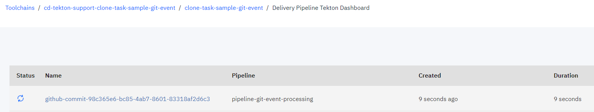
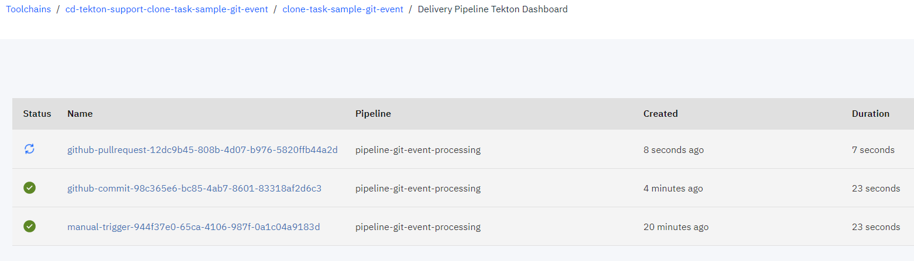
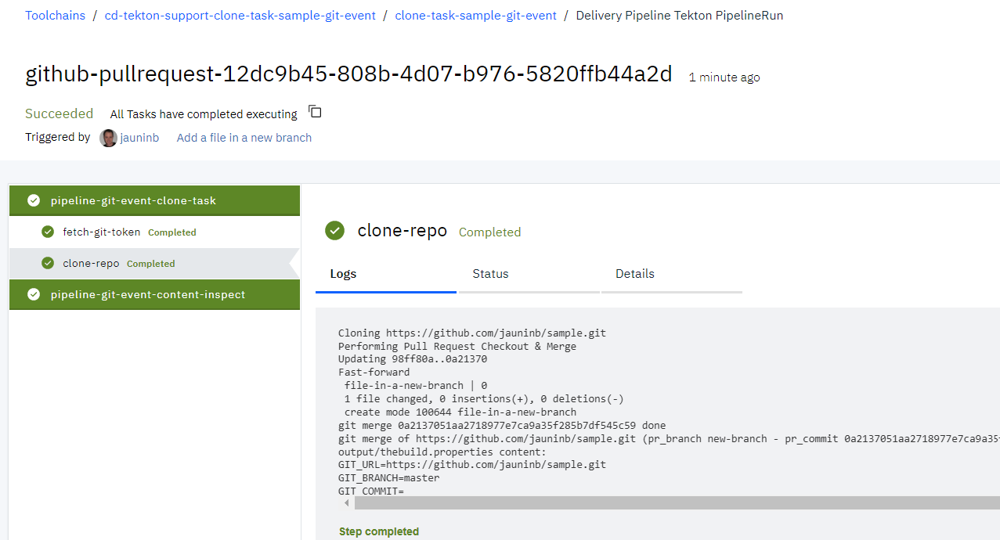
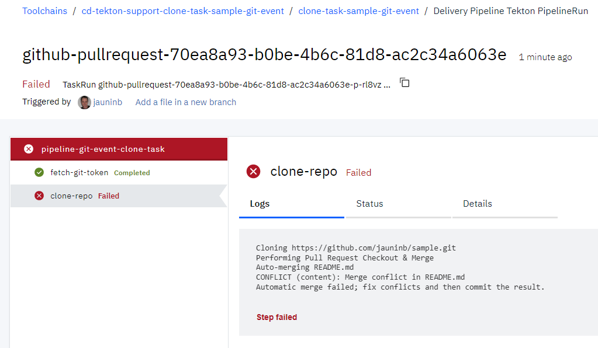

## Git event trigger with clone task sample usage ##

This `sample-git-trigger` sub-directory contains several EventListener definitions that you can include in your CD tekton pipeline configuration to run an example demonstrating the usage of the `git-clone-repo` in the context of a CD Tekton pipeline triggered by a Git event (Commit push or PullRequest push/update).

This sample illustrates the PullRequest support provided by the `git-clone-repo` (il n'y a pas de git-clone task, correct?) that results in a Git repository content that would be identical to the one obtained after a merge action on the given PullRequest (or Merge Request for a Gitlab or GRIT server).

1) Create or update a Toolchain to include:

   - the github.com repository that you want to clone
   - (optional) the GRIT repository that you want to clone
   - (optional) the BitBucket repository that you want to clone
   - the repository containing this Tekton task
   - a Tekton pipeline definition

   

2) Add the definitions of this task and the sample (`git` and `git/sample-git-trigger` paths)

   

3) Add the environment properties:

   - `apikey`: the API key used for the ibmcloud login/access
   - `repositoryForManualTrigger`: the URL of the Git repository to clone (corresponding to the one integrated in the Toolchain) when using the ManualTrigger.

   

4) Create a manual trigger to manually start the `event-listener-pr-processing-manual` listener.

   

5) Run the pipeline by starting the Manual Trigger.

   

   

6) Check the logs of the pipeline run execution.

   

7) Create Git Triggers for the different Git repositories that you have integrated to your Toolchain (corresponding to the repositories integrated to your Toolchain).
   
   Github:
    - `eventlistener-git-trigger-github-commit` for Github Commit pushed event

      

    - `eventlistener-git-trigger-github-pr` for Github PullRequest opened/updated event

      

   GRIT/Gitlab:
    - `eventlistener-git-trigger-grit-commit` for GRIT/Gitlab Commit pushed event
    - `eventlistener-git-trigger-grit-mr` for GRIT/Gitlab MergeRequest opened/updated event

   BitBucket:
    - `eventlistener-git-trigger-bitbucket-commit` for BitBucket Commit pushed event
    - `eventlistener-git-trigger-bitbucket-pr` for BitBucket PullRequest opened/updated event

8) **Trigger on commit**: update the code in one of the repository that has the above triggers defined, using the tool and environment of your choice:
  
   ```
   $ git clone https://github.com/jauninb/sample.git
   Cloning into 'sample'...

   $ cd sample

   $ touch new-file-there

   $ git add .

   $ git commit -m "Add a new file"
   [master 309fde4] Add a new file
   1 file changed, 0 insertions(+), 0 deletions(-)
   create mode 100644 new-file-there

   $ git push origin master
   Enumerating objects: 3, done.
   Counting objects: 100% (3/3), done.
   To https://github.com/jauninb/sample.git
      44988fe..309fde4  master -> master
   ```

   Observe: a new pipeline run is automatically started, triggered by this commit.

   

9) **Trigger on PullRequest**: in one of your repository that has the above triggers defined, define a new Git branch, push some code changes and create a new PullRequest to the default `master` branch.

   

   

   Observe: a new pipeline run is automatically started, triggered by this PullRequest.

   

   Note: The clone-task execution will produce the same repository content as the "Merge Pull Request" action/button would.

   


   Note: if a PullRequest can not be merged, due to conflict(s):

   

   Expect the corresponding pipeline run to fail, as the merge can not be made automatically:

   

   Note: the `clone-task` task run fails during the `clone-repo` step execution:

   
