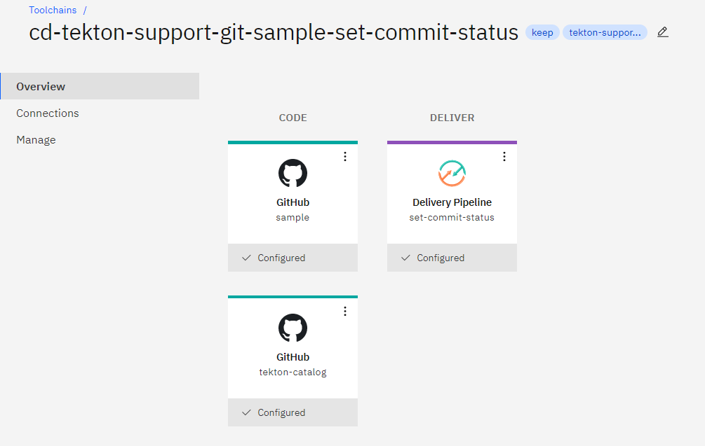
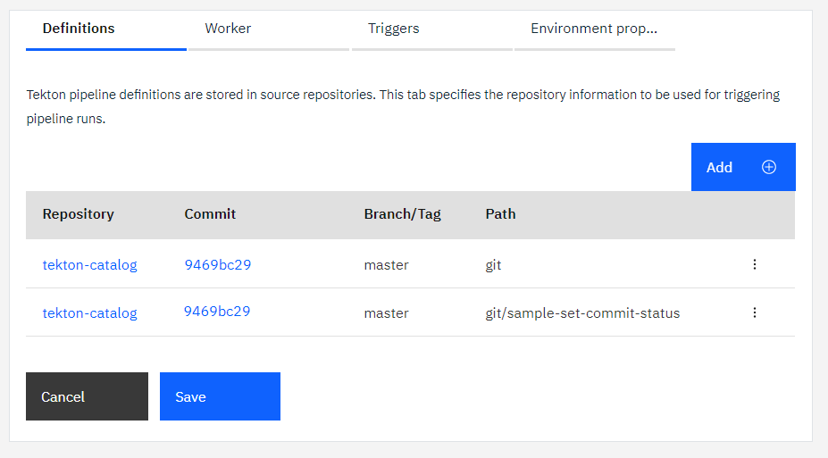
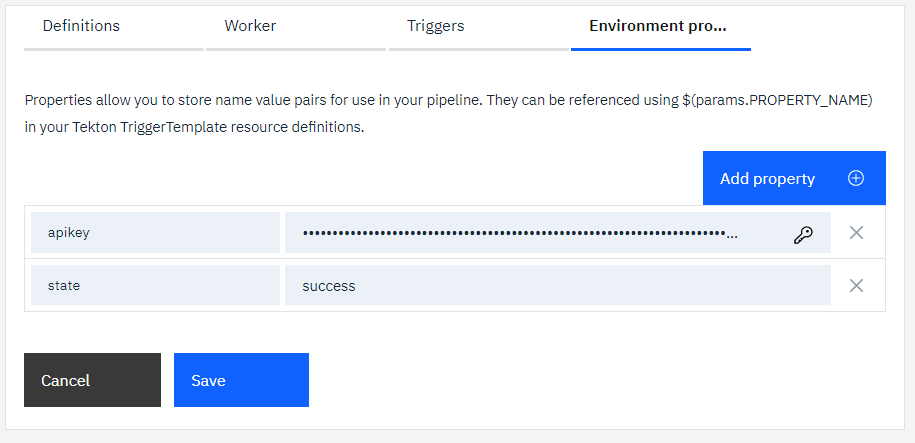
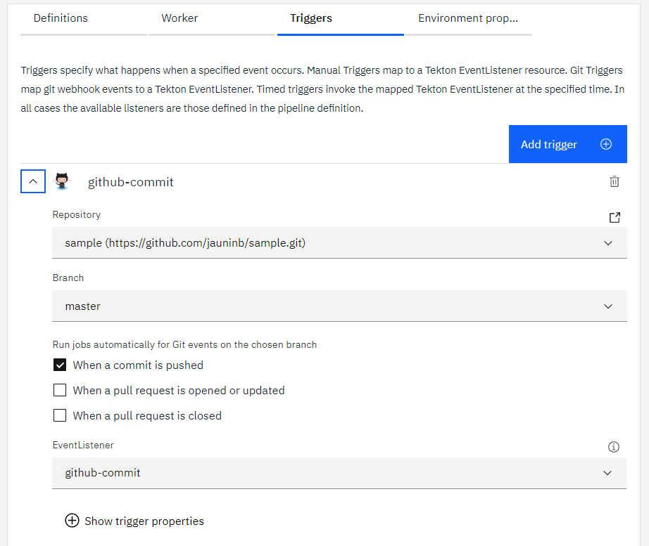
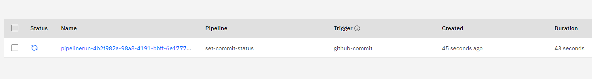
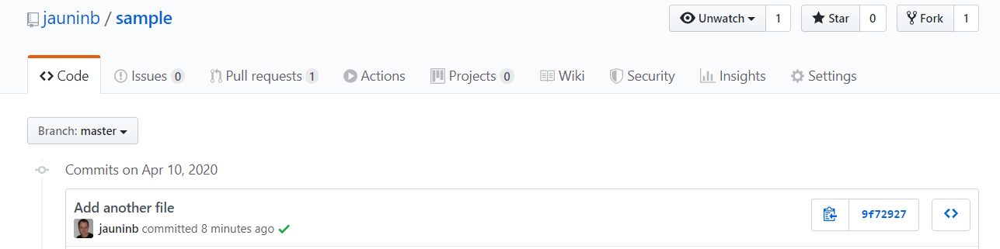

## Git set commit status task sample usage ##

This `sample-set-commit-status` sub-directory contains several EventListener definitions that you can include in your CD tekton pipeline configuration to run an example demonstrating the usage of the `set-commit-status` task in the context of a CD Tekton pipeline triggered by a Git event (Commit push).

This sample illustrates the commit status support provided by the `set-commit-status` task that results in a git commit on the target git repository updated with a status (`success` by default).

1) Create or update a Toolchain to include:

   - the github.com repository that you want to clone and set status on a given commit
   - (optional) the GRIT repository that you want to clone
   - (optional) the BitBucket repository that you want to clone
   - the repository containing this Tekton task
   - a Tekton pipeline definition

   

2) Add the definitions of this task and the sample (`git` and `git/sample-set-commit-status` paths)

   

3) Add the environment properties:

   - `apikey`: the API key used for the ibmcloud login/access
   - `state`: (optional) the state value you want to set to a commit. 

   

4) Create Git Triggers for the different Git repositories that you have integrated to your Toolchain (corresponding to the repositories integrated to your Toolchain).
   
   Event Listeners:
    - `github-commit` for Github Commit pushed event
    - `gitlab-commit` for GRIT/Gitlab Commit pushed event
    - `bitbucket-commit` for BitBucket Commit pushed event

   


5) **Trigger on commit**: update the code in one of the repository that has the above triggers defined, using the tool and environment of your choice:
  
   ```
   $ git clone https://github.com/jauninb/sample.git
   Cloning into 'sample'...

   $ cd sample

   $ touch another-file-there

   $ git add .

   $ git commit -m "Add another file"
   [master 9f72927] Add another file
   1 file changed, 0 insertions(+), 0 deletions(-)
   create mode 100644 another-file-there

   $ git push origin master
   Enumerating objects: 3, done.
   Counting objects: 100% (3/3), done.
   Delta compression using up to 8 threads
   Compressing objects: 100% (2/2), done.
   Writing objects: 100% (2/2), 230 bytes | 115.00 KiB/s, done.
   Total 2 (delta 1), reused 0 (delta 0)
   remote: Resolving deltas: 100% (1/1), completed with 1 local object.
   To https://github.com/jauninb/sample.git
      f33b7ff..9f72927  master -> master
   ```

   Observe: a new pipeline run is automatically started, triggered by this commit.

   

6) After the pipeline run is finished, the commit status can be seen in the selected git repository

   
