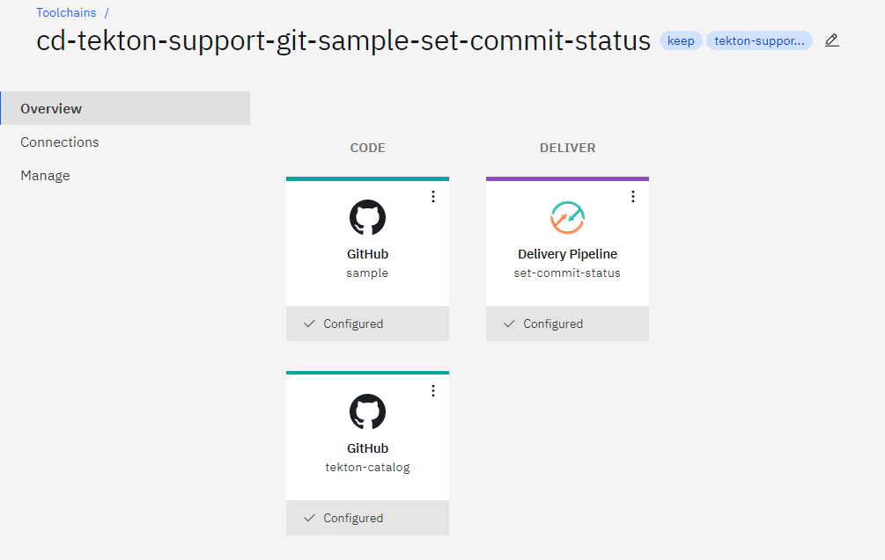
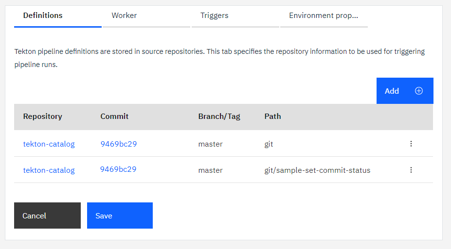
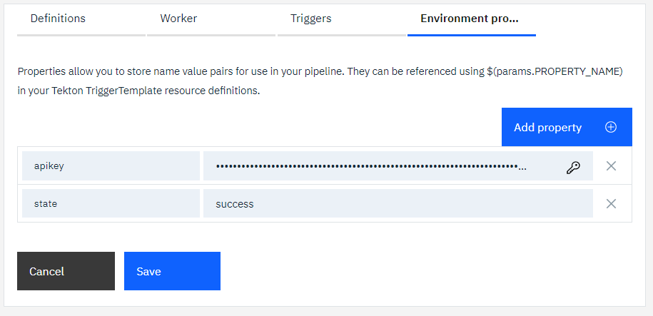
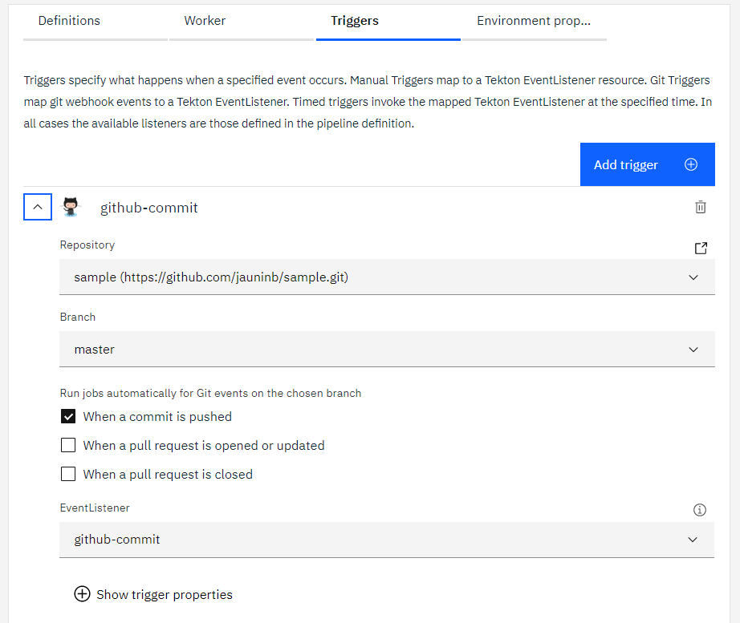
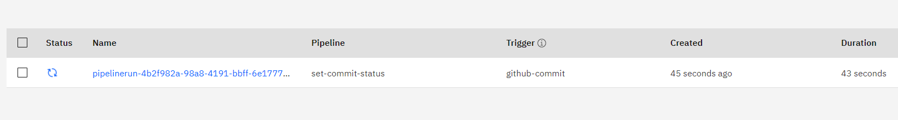
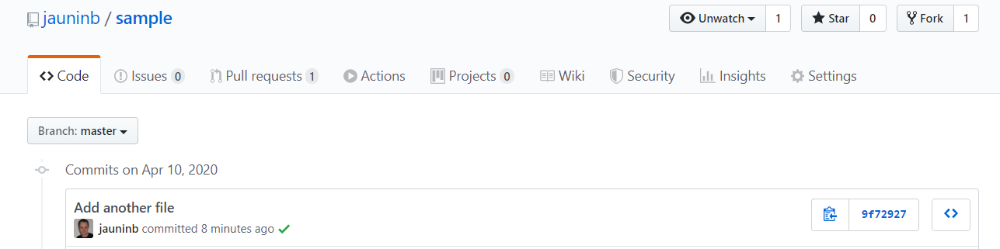

## Git set commit status task sample usage ##

This `sample-set-commit-status` sub-directory contains several EventListener definitions that you can include in your CD tekton pipeline configuration to run an example demonstrating the usage of the `git-set-commit-status` task in the context of a CD Tekton pipeline triggered by a Git event (Commit push).

This sample illustrates the commit status support provided by the `git-set-commit-status` task that results in a git commit on the target git repository updated with a status (`success` by default).

1) Create or update a Toolchain to include:

   - the github.com repository that you want to clone and set status on a given commit
   - (optional) the GRIT repository that you want to clone
   - (optional) the BitBucket repository that you want to clone
   - the repository containing this Tekton task
   - a Tekton pipeline definition

   

2) Add the definitions of this task and the sample (`git` and `git/sample-set-commit-status` paths)

   

3) Add the environment properties:

   - `apikey`: the API key used for the ibmcloud login/access
   - `state`: (optional) the state value you want to set to a commit.

   

4) Create Git Triggers for the different Git repositories that you have integrated to your Toolchain (corresponding to the repositories integrated to your Toolchain).

   Event Listeners:
    - `github-commit` for Github Commit pushed event
    - `gitlab-commit` for GRIT/Gitlab Commit pushed event
    - `bitbucket-commit` for BitBucket Commit pushed event

   


5) **Trigger on commit**: update the code in one of the repository that has the above triggers defined, using the tool and environment of your choice:

   ```
   $ git clone https://github.com/jauninb/sample.git
   Cloning into 'sample'...

   $ cd sample

   $ touch another-file-there

   $ git add .

   $ git commit -m "Add another file"
   [master 9f72927] Add another file
   1 file changed, 0 insertions(+), 0 deletions(-)
   create mode 100644 another-file-there

   $ git push origin master
   Enumerating objects: 3, done.
   Counting objects: 100% (3/3), done.
   Delta compression using up to 8 threads
   Compressing objects: 100% (2/2), done.
   Writing objects: 100% (2/2), 230 bytes | 115.00 KiB/s, done.
   Total 2 (delta 1), reused 0 (delta 0)
   remote: Resolving deltas: 100% (1/1), completed with 1 local object.
   To https://github.com/jauninb/sample.git
      f33b7ff..9f72927  master -> master
   ```

   Observe: a new pipeline run is automatically started, triggered by this commit.

   

6) After the pipeline run is finished, the commit status can be seen in the selected git repository

   

## Detailed Description

This pipeline and relevant trigger(s) can be configured using the properties described below.

See https://cloud.ibm.com/docs/ContinuousDelivery?topic=ContinuousDelivery-tekton-pipelines&interface=ui#configure_tekton_pipeline for more information.


**EventListeners:**

- [github-commit](#github-commit) - github pull-request listener for sample
- [gitlab-commit](#gitlab-commit) - grit/gitlab merge-request listener for sample
- [bitbucket-commit](#bitbucket-commit) - bitbucket pull-request listener for sample

### github-commit

**EventListener**: github-commit - github pull-request listener for sample


| Properties | Description | Default | Required | Type |
|------------|-------------|---------|----------|------|
| `apikey` (**secured property**) | [IBM Cloud Api Key](https://cloud.ibm.com/iam/apikeys) used to access to the toolchain (and git intergation toolcard like `Git Repos and Issue Tracking` service if used). | - | Yes | secret |
| `branch` | the branch for the git repo | `$(event.ref)` | No | string |
| `description` | A short description of the status | `status from cd tekton` | No | string |
| `pipeline-debug` | Pipeline debug mode. Value can be 0 or 1. | `0` | No | string |
| `repository` | The git repo | `$(event.repository.url)` | No | string |
| `revision` | the git revision/commit to update the git HEAD to. Default is to mean only use the branch | `$(event.head_commit.id)` | No | string |
| `state` | The state of the status. Can be one of the following: pending, success, error, or failure | `success` | No | string |


### gitlab-commit

**EventListener**: gitlab-commit - grit/gitlab merge-request listener for sample


| Properties | Description | Default | Required | Type |
|------------|-------------|---------|----------|------|
| `apikey` (**secured property**) | [IBM Cloud Api Key](https://cloud.ibm.com/iam/apikeys) used to access to the toolchain (and git intergation toolcard like `Git Repos and Issue Tracking` service if used). | - | Yes | secret |
| `branch` | the branch for the git repo | `$(event.ref)` | No | string |
| `description` | A short description of the status | `status from cd tekton` | No | string |
| `pipeline-debug` | Pipeline debug mode. Value can be 0 or 1. | `0` | No | string |
| `repository` | The git repo | `$(event.repository.git_http_url)` | No | string |
| `revision` | the git revision/commit to update the git HEAD to. Default is to mean only use the branch | `$(event.checkout_sha)` | No | string |
| `state` | The state of the status. Can be one of the following: pending, success, error, or failure | `success` | No | string |


### bitbucket-commit

**EventListener**: bitbucket-commit - bitbucket pull-request listener for sample


| Properties | Description | Default | Required | Type |
|------------|-------------|---------|----------|------|
| `apikey` (**secured property**) | [IBM Cloud Api Key](https://cloud.ibm.com/iam/apikeys) used to access to the toolchain (and git intergation toolcard like `Git Repos and Issue Tracking` service if used). | - | Yes | secret |
| `branch` | the branch for the git repo | `$(event.push.changes[0].new.name)` | No | string |
| `description` | A short description of the status | `status from cd tekton` | No | string |
| `pipeline-debug` | Pipeline debug mode. Value can be 0 or 1. | `0` | No | string |
| `repository` | The git repo | `$(event.repository.links.html.href)` | No | string |
| `revision` | the git revision/commit to update the git HEAD to. Default is to mean only use the branch | `$(event.push.changes[0].new.target.hash)` | No | string |
| `state` | The state of the status. Can be one of the following: pending, success, error, or failure | `success` | No | string |
