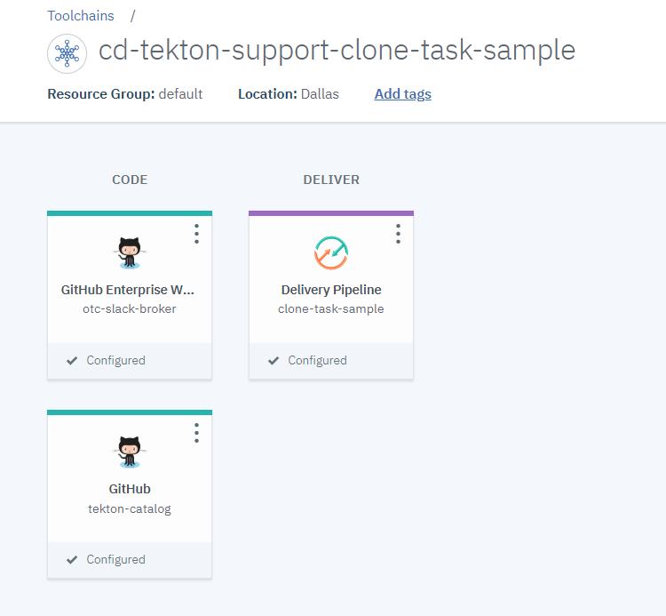
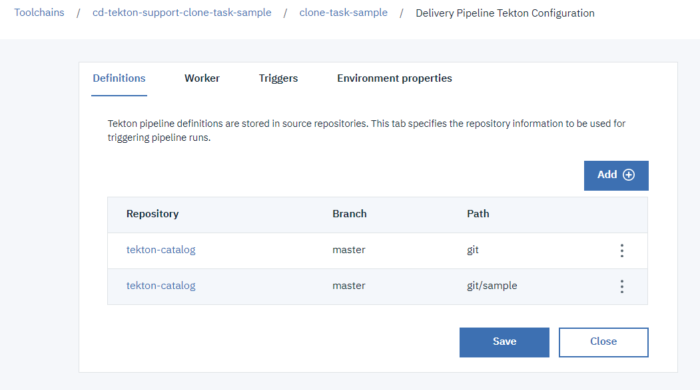
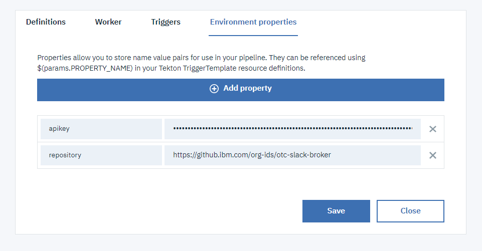
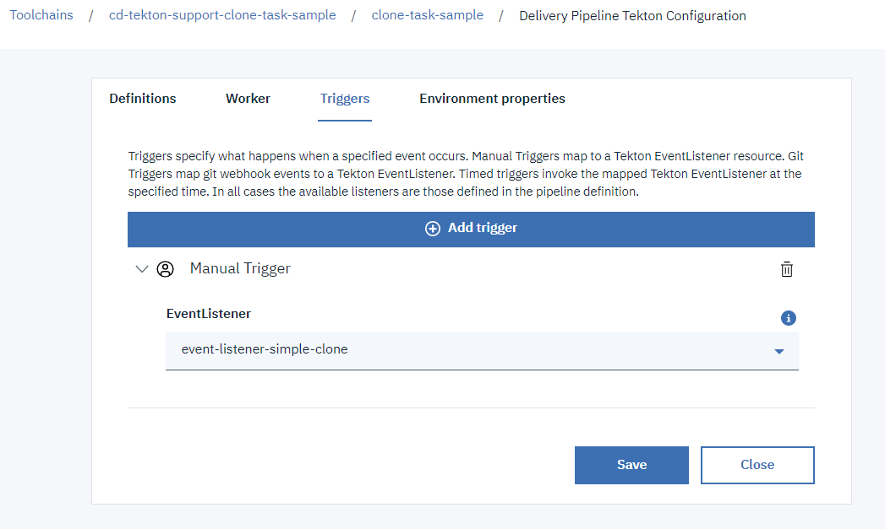

## Simple clone-task usage ##

This `sample` sub-directory contains an EventListener definition that you can include in your tekton pipeline configuration to run an example showing a simple usage of the `git-clone-repo`

1) Create a toolchain (or update a toolchain) to include:

   - the git repository that you want to clone, which can be private
   - the repository containing this tekton task
   - a tekton pipeline definition

   

2) Add the definitions of this task and the sample (`git` and `git/sample` paths)

   

3) Add the environment properties:

   - `apikey` to provide an API key used for the ibmcloud login/access
   - `repository` to indicate the git repository url to clone (correspoding to the one integrated in the toolchain)

   

4) Create a manual trigger to start the sample listener

   

5) Run the pipeline

## Detailed Description

This pipeline and relevant trigger(s) can be configured using the properties described below.

See https://cloud.ibm.com/docs/ContinuousDelivery?topic=ContinuousDelivery-tekton-pipelines&interface=ui#configure_tekton_pipeline for more information.

### event-listener-simple-clone

**EventListener**: event-listener-simple-clone - simple clone

| Properties | Description | Default | Required | Type |
|------------|-------------|---------|----------|------|
| `apikey` (**secured property**) | [IBM Cloud Api Key](https://cloud.ibm.com/iam/apikeys) used to access to the toolchain (and git intergation toolcard like `Git Repos and Issue Tracking` service if used). | - | Yes | secret |
| `branch` | the branch for the git repo | `master` | No | string |
| `git-access-token` | illustrate alternate way to provide/get git access token | `` | No | string |
| `pipeline-debug` | - | `0` | No | string |
| `repository` | the git repo | - | Yes | string |
