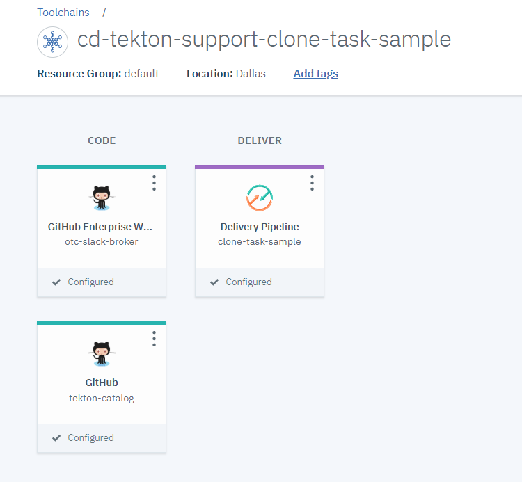
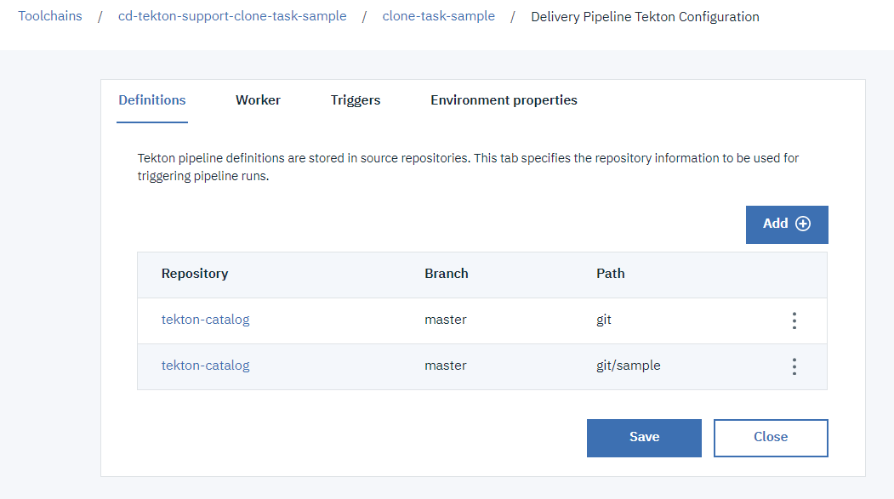
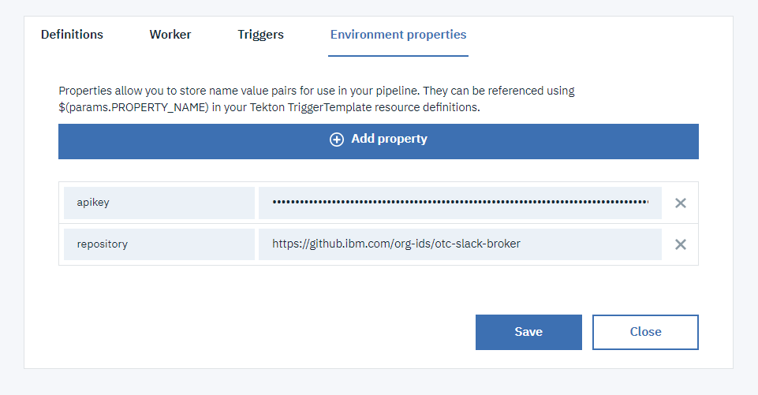
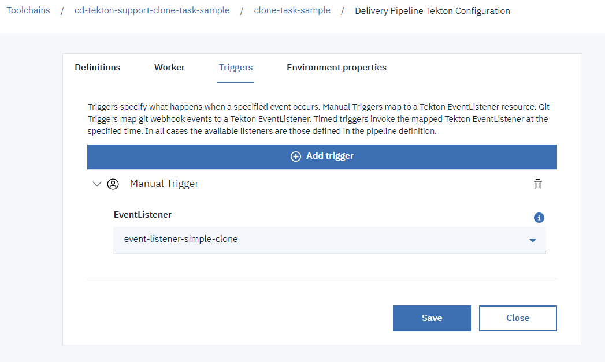

## Simple clone-task usage ##

This `sample` sub-directory contains an EventListener definition that you can include in your tekton pipeline configuration to run an example showing a simple usage of the `clone-repo-task`

1) Create a toolchain (or update a toolchain) to include:

   - the git repository that you want to clone, which can be private
   - the repository containing this tekton task
   - a tekton pipeline definition

   

2) Add the definitions of this task and the sample (`git` and `git/sample` paths)

   

3) Add the environment properties:

   - `apikey` to provide an API key used for the ibmcloud login/access
   - `repository` to indicate the git repository url to clone (correspoding to the one integrated in the toolchain)

   

4) Create a manual trigger to start the sample listener

   

5) Run the pipeline
