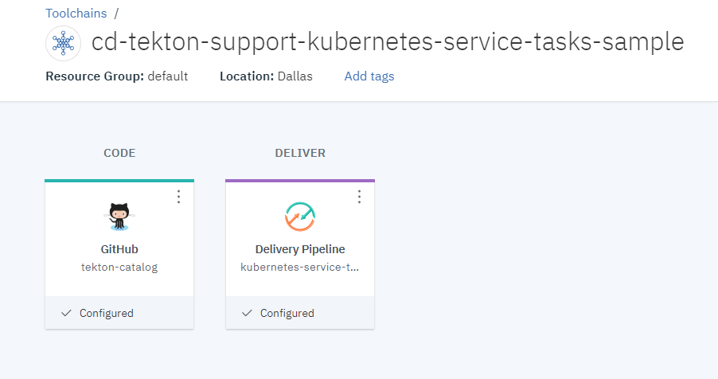
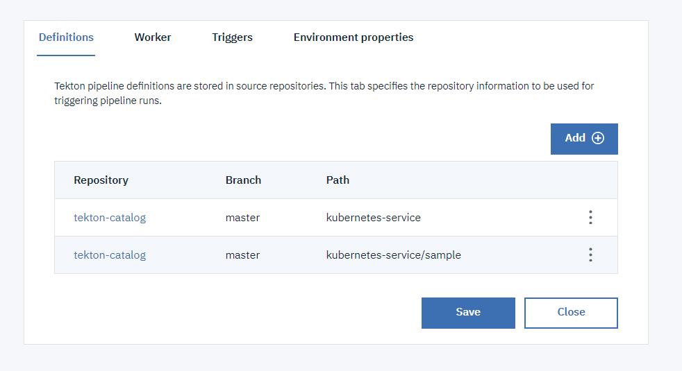
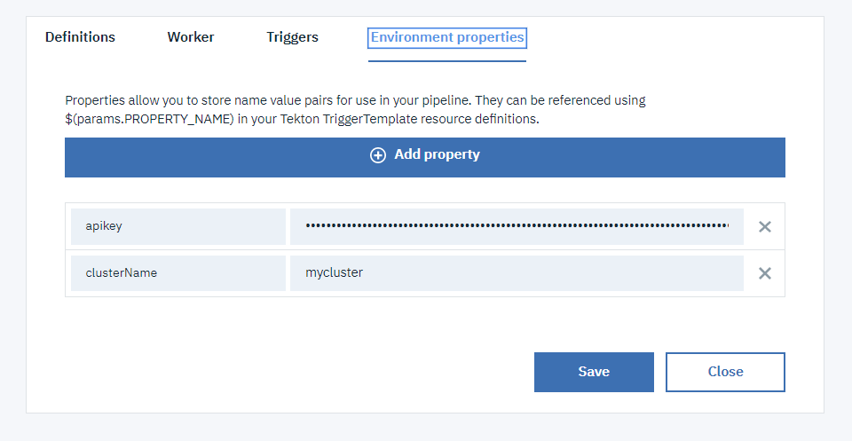
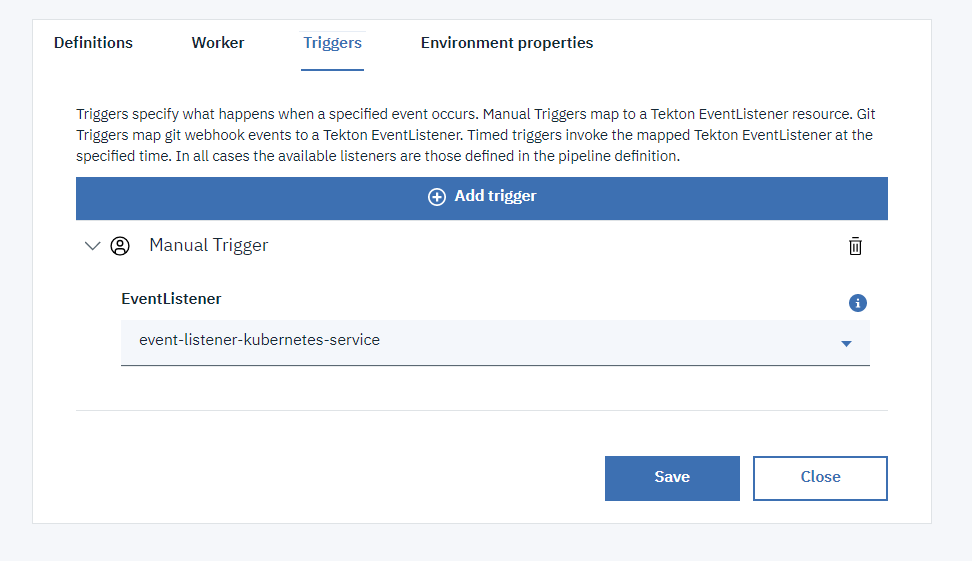

## Simple kubernetes related tasks sample ##

This `sample` sub-directory contains an EventListener definition `kubernetes-service-no-resources` that you can include in your tekton pipeline configuration to run an example usage of the `iks-fetch-config` and `iks-contextual-execution` tasks.

1) Create a toolchain (or update a toolchain) to include:

   - the git repository that you want to clone, which can be private
   - the repository containing this tekton task
   - a tekton pipeline definition

   

2) Add the definitions:

   - for the tasks and the sample (`kubernetes-service` and `kubernetes-service/sample` paths)

   

3) Add the environment properties:

   - `apikey` to provide an API key used for the ibmcloud login/access
   - `cluster-name` to indicate the name of the IKS cluster that you want to target

   

4) Create a manual trigger to start the sample listener

   

5) Run the pipeline
