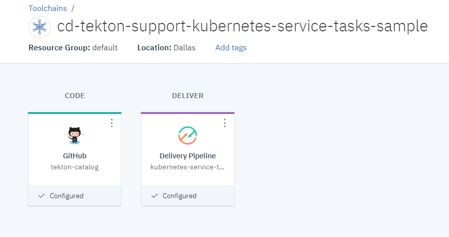
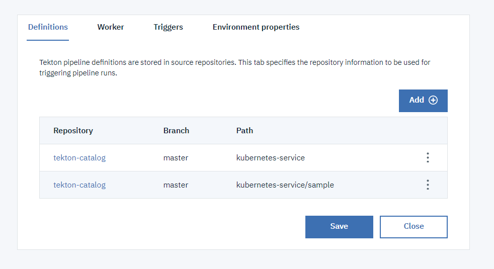
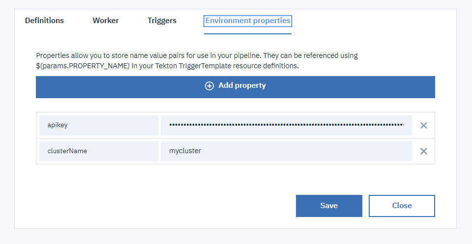
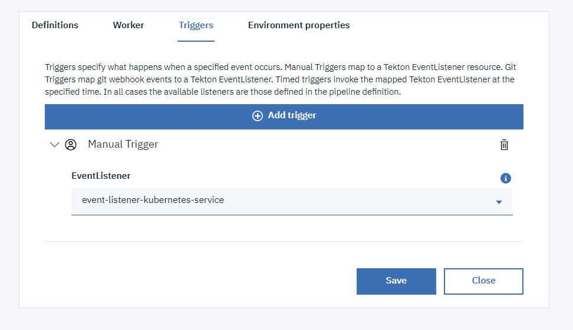

## Simple kubernetes related tasks sample ##

This `sample` sub-directory contains an EventListener definition `kubernetes-service-no-resources` that you can include in your tekton pipeline configuration to run an example usage of the `iks-fetch-config` and `iks-contextual-execution` tasks.

1) Create a toolchain (or update a toolchain) to include:

   - the git repository that you want to clone, which can be private
   - the repository containing this tekton task
   - a tekton pipeline definition

   

2) Add the definitions:

   - for the tasks and the sample (`kubernetes-service` and `kubernetes-service/sample` paths)

   

3) Add the environment properties:

   - `apikey` to provide an API key used for the ibmcloud login/access
   - `cluster-name` to indicate the name of the IKS cluster that you want to target
   - `resource-group` to indicate the resource group being used. Example defaults to `default`

   

4) Create a manual trigger to start the sample listener

   

5) Run the pipeline

## Detailed Description

This pipeline and relevant trigger(s) can be configured using the properties described below.

See https://cloud.ibm.com/docs/ContinuousDelivery?topic=ContinuousDelivery-tekton-pipelines&interface=ui#configure_tekton_pipeline for more information.

### kubernetes-service-no-resources

**EventListener**: kubernetes-service-no-resources

| Properties | Description | Default | Required | Type |
|------------|-------------|---------|----------|------|
| `apikey` (**secured property**) | the api key used to login to ibmcloud kubernetes service | - | Yes | secret |
| `cluster-name` | name of the cluster - required if no cluster pipeline resource provided to this task | - | Yes | string |
| `cluster-region` | (optional) the ibmcloud region hosting the cluster (if none is found it will default to the toolchain region) | - | Yes | string |
| `pipeline-debug` | Pipeline debug mode. Value can be 0 or 1. | `0` | No | string |
| `resource-group` | target resource group (name or id) for the ibmcloud login operation | `default` | No | string |
