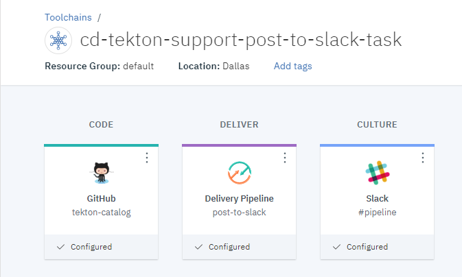
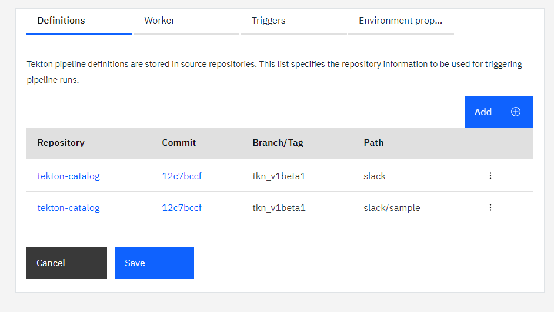
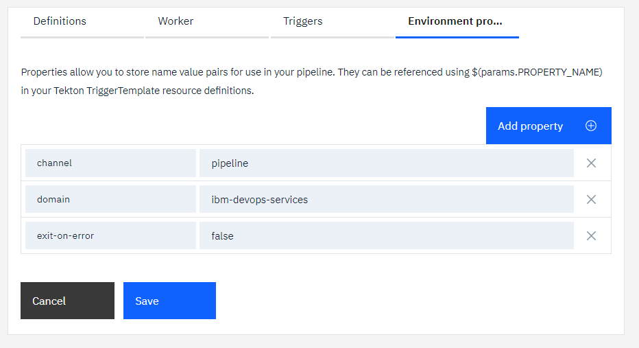
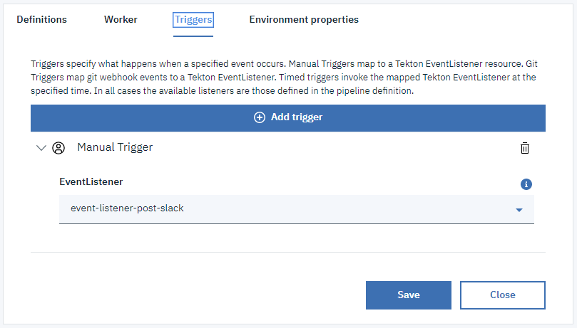
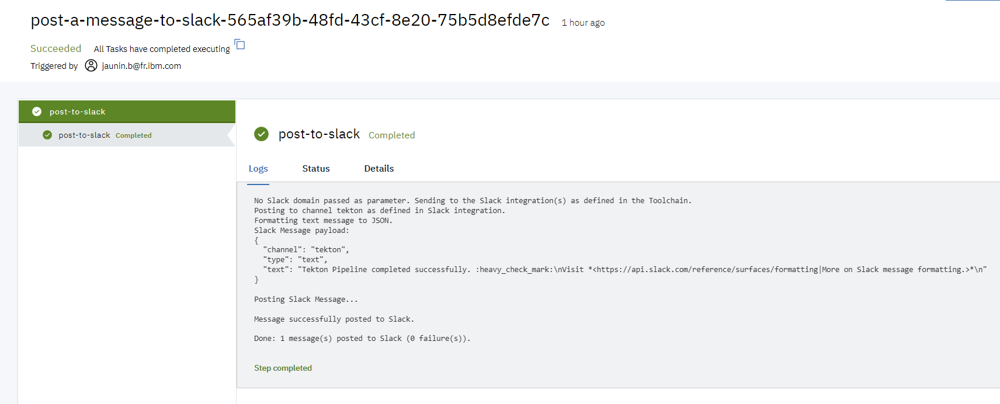
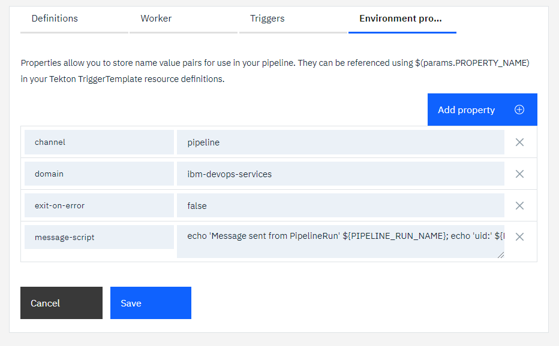
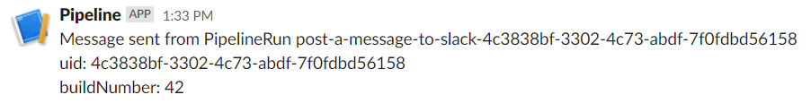
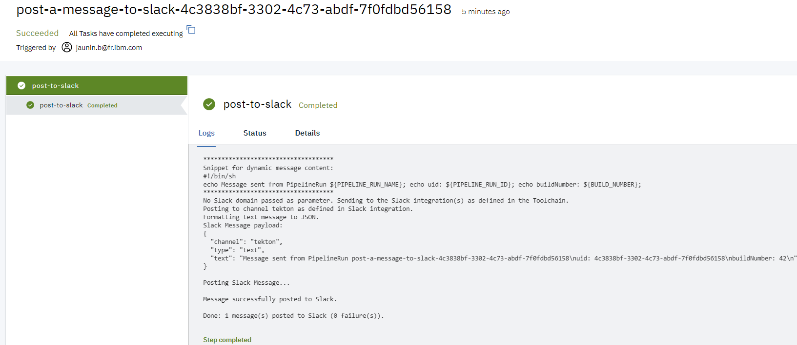

This `sample` sub-directory contains an EventListener and Pipeline definition that you can include in your Tekton pipeline configuration to run an example of the `slack-post-message` task.

1) Create or update a Toolchain so it includes:
   - a Slack integration
   - the repository containing this tekton task
   - a Tekton pipeline definition

   

2) Add the definitions of this task and the sample (`slack` and `slack/sample` paths)

   

3) Add the environment properties as needed:

   - `domain` (optional) the Slack domain to send the message to.
   - `channel` (optional) the channel to post to (overrides the dafault channel as set in the Slack webhook).
   - `message-format` (optional) the format of the message (text or JSON).
   - `message-script` (optional) Shell script that provides messsage content.
   - `message` (optional) the message to post to Slack.

**Note:** when using JSON format, the message is posted as-is to Slack.

   

4) Create a manual trigger to start the sample listener

   

5) Run the pipeline

6) The message is posted to Slack

   

7) Optional: check the execution log

   

8) Optional: Create a message using snippet

   a) Define the snippet in the `message-script` environment property of the pipeline

       message-script: `echo 'Message sent from PipelineRun' ${PIPELINE_RUN_NAME}; echo 'uid:' ${PIPELINE_RUN_ID}; echo 'buildNumber:' ${BUILD_NUMBER};`

      Note: this could also be done in the trigger-template or pipeline definition

      

   b) After running the pipeline, a new message like the following should have been posted to the Slack channel

      

   c) Check the execution log

      

## Detailed Description

This pipeline and relevant trigger(s) can be configured using the properties described below.

See https://cloud.ibm.com/docs/ContinuousDelivery?topic=ContinuousDelivery-tekton-pipelines&interface=ui#configure_tekton_pipeline for more information.

### event-listener-post-slack

**EventListener**: event-listener-post-slack - listener for slack sample

| Properties | Description | Default | Required | Type |
|------------|-------------|---------|----------|------|
| `channel` | the Slack channel to send the message to.
When set, overrides the default channel as set in the Slack Webhook URL.
 | ` ` | No | string |
| `domain` | the Slack domain to send the message to.
If not set, the message will be posted to the Slack integration(s) as defined in the Toolchain.
 | ` ` | No | string |
| `exit-on-error` | flag (`true` | `false`) to indicate if the task should fail
or continue if unable to process the message or post to Slack.
 | `false` | No | string |
| `message` | the message to send to Slack | `Tekton Pipeline completed successfully. :heavy_check_mark:
Visit *<https://api.slack.com/reference/surfaces/formatting|More on Slack message formatting.>*
` | No | string |
| `message-format` | the format of the message. text(default) or JSON. | `text` | No | string |
| `message-script` | Shell script that provides messsage content. | ` ` | No | string |
| `pipeline-debug` | - | `0` | No | string |
