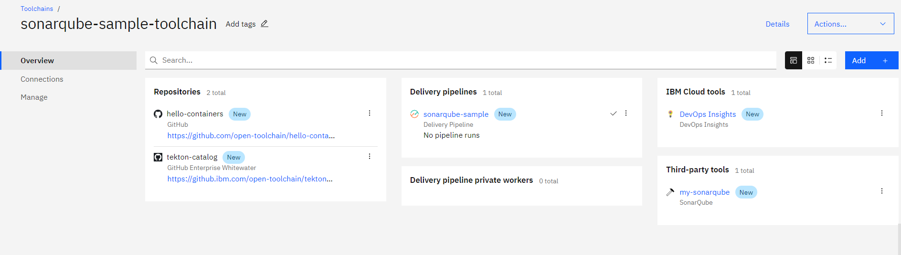
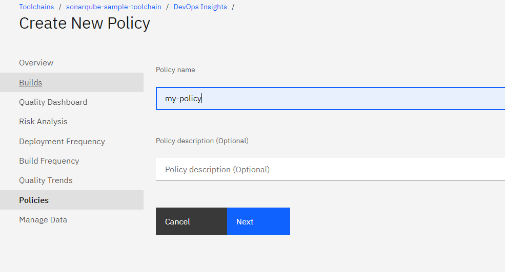
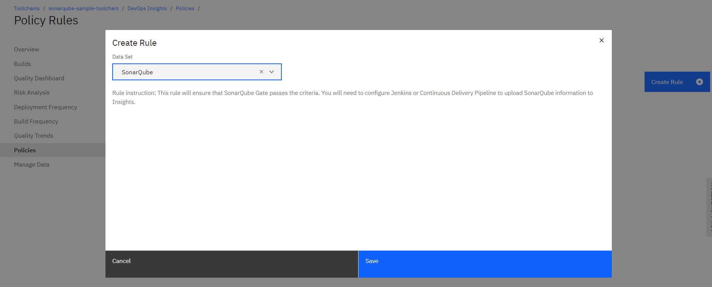
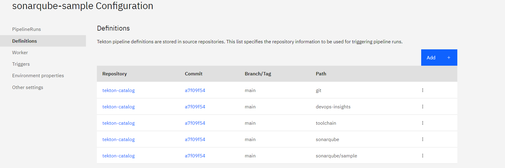
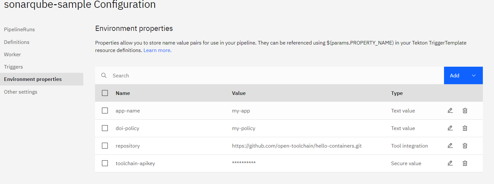
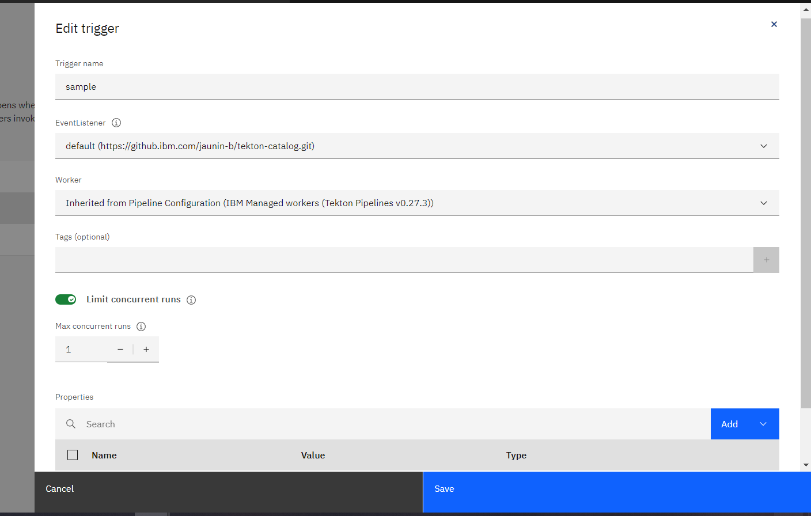
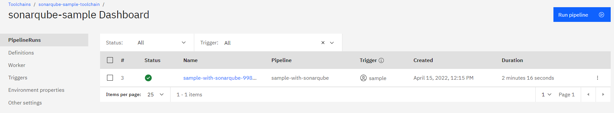
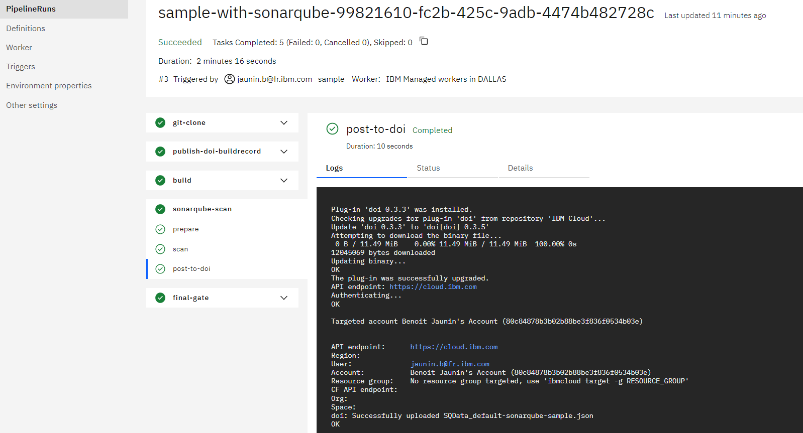
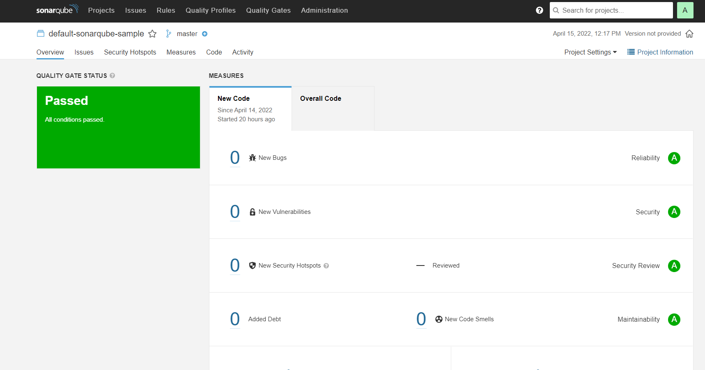
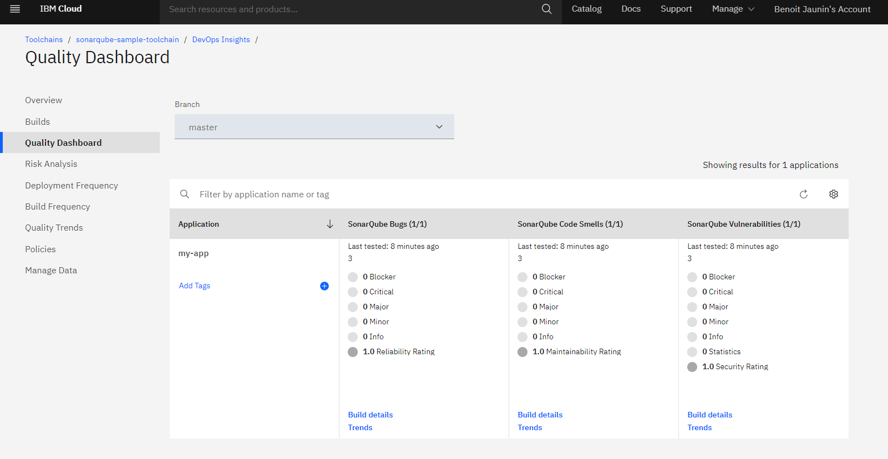

# Sonarqube Scan Task example usage
The `sample` sub-directory contains an `event-listener-container-registry` EventListener definition that you can include in your tekton pipeline configuration to run an example usage of the `sonarqube-run-scan`.

**Note:** this sample also relies on the `git-clone-repo`, `doi-publish-buildrecord`, `toolchain-build` and `doi-evaluate-gate`  tasks to clone the application, perform a build script, push the appropriate information to DevOps Insights and use the DevOps insights gate for evaluation.

1) Create or update a toolchain to include:

   - the git repository containing the source to scan - that will be git clone, which can be private - for instance `https://github.com/open-toolchain/hello-containers.git`
   - the git repository containing this tekton task
   - a DevOps Insights integration
   - a SonarQube integration
   - a [Tekton pipeline definition](https://cloud.ibm.com/docs/ContinuousDelivery?topic=ContinuousDelivery-tekton-pipelines#create_tekton_pipeline)

   

2) Define a policy in DevOps Insights that will be evaluated - It only need to have one rule related to sonarqube test result in it.
    - Click on the DevOps Insights card
    - Create a [policy](https://cloud.ibm.com/docs/ContinuousDelivery?topic=ContinuousDelivery-defining-policies-rules#create_policies) with a name
      
    - Add a new [rule](https://cloud.ibm.com/docs/ContinuousDelivery?topic=ContinuousDelivery-defining-policies-rules#create_policies) to include SonarQube Data set
      

3) Add the tekton definitions in the tekton pipeline:

   - for the `git-clone-repo` task (`git` path)
   - for the DevOps Insights tasks `doi-publish-buildrecord` and `doi-evaluate-gate` (`devops-insights` path)
   - for the `toolchain-build` task (`toolchain` path)
   - for this task and the sample (`sonarqube` and `sonarqube/sample` paths)

   

4) Choose a Worker for the pipeline - Select one of the IBM Managed workers

5) Add the environment properties:

   - `app-name` the name of the application
   - `doi-policy` to indicate the name of DevOps Insoghts Policy you have created in previous step
   - `toolchain-apikey` to provide an API key used for the ibmcloud login/access
   - `repository` to indicate the git repository url to clone (correspoding to the one integrated in the toolchain)

   

5) Create a manual trigger to start the `default` EventListener

   

   If your sample code is a maven project then you can select the alternate `maven` EventListener that will define the appropriate command and target `mvn sonar:sonar` to perform the sonarqube scan

6) Run the pipeline using the manual trigger created

   When pipeline-run is started (or terminated) you can click on it to open the pipelinerun dashboard

   

   You can then see the detail of the pipeline execution and especially the sonarqube scan task

   

7) If you navigate to the sonarqube server, the sonarqube project will have been created and scanned

   

8) The DevOps insights dashboard shows also the SonarQube scan result

   

## Detailed Description

This pipeline and relevant trigger(s) can be configured using the properties described below.

See https://cloud.ibm.com/docs/ContinuousDelivery?topic=ContinuousDelivery-tekton-pipelines&interface=ui#configure_tekton_pipeline for more information.

### default

**EventListener**: default

| Properties | Description | Default | Required | Type |
|------------|-------------|---------|----------|------|
| `apikey` (**secured property**) | [IBM Cloud Api Key](https://cloud.ibm.com/iam/apikeys) used to access to the toolchain (and git intergation toolcard like `Git Repos and Issue Tracking` service if used). | - | Yes | secret |
| `app-name` | application name | - | Yes | string |
| `branch` | the branch for the git repo | `master` | No | string |
| `build-script` | script executed in build task | - | Yes | string |
| `directory-name` | the directory to clone | - | Yes | string |
| `doi-policy` | DevOps Insights polciy to evaluate | `sonarqube-policy` | No | string |
| `doi-sonarqube-token` (**secured property**) | the SonarQube token to publish the SonarQube report to DOI.
It has some specific permissions which are required that a Global Analysis Token may not have.
See https://cloud.ibm.com/docs/devsecops?topic=devsecops-sonarqube#permissions-for-sonarqube-token
 | - | Yes | secret |
| `doi-sonarqube-token-secret-key` | field in the secret that contains the SonarQube token to publish the SonarQube report to DOI.
It has some specific permissions which are required that a Global Analysis Token may not have.
See https://cloud.ibm.com/docs/devsecops?topic=devsecops-sonarqube#permissions-for-sonarqube-token
 | `doi-sonarqube-token` | No | string |
| `ibmcloud-api` | the ibmcloud api | `https://cloud.ibm.com` | No | string |
| `pipeline-debug` | Pipeline debug mode. Value can be 0 or 1. | `0` | No | string |
| `repository` | the git repo containing source code. If empty, the repository url will be found from toolchain | - | Yes | string |
| `revision` | the git revision/commit for the git repo | - | Yes | string |
| `scan-step-image` | - | `icr.io/continuous-delivery/toolchains/devsecops/sonar-scanner-cli:29-11-2024-10-26` | No | string |
| `sonar-scan-command` | command for sonarqube scan | `sonar-scanner -Dsonar.working.directory=$SONAR_DIR` | No | string |
| `sonarqube-name` | name of the sonarqube toolcard integration in the toolchain
("" meaning the first sonarqube integration found will be used)
 | - | Yes | string |
| `sonarqube-project-key` | - | `default-sonarqube-sample` | No | string |
| `toolchain-apikey` (**secured property**) | the api key used to access toolchain and DOI instance | - | Yes | secret |
| `toolchain-apikey-secret-key` | field in the secret that contains the api key used to access toolchain and DOI instance | `toolchain-apikey` | No | string |

### maven

**EventListener**: maven

| Properties | Description | Default | Required | Type |
|------------|-------------|---------|----------|------|
| `apikey` (**secured property**) | [IBM Cloud Api Key](https://cloud.ibm.com/iam/apikeys) used to access to the toolchain (and git intergation toolcard like `Git Repos and Issue Tracking` service if used). | - | Yes | secret |
| `app-name` | application name | - | Yes | string |
| `branch` | the branch for the git repo | `master` | No | string |
| `build-script` | script executed in build task | `mvn -Dmaven.repo.local="${WORKSPACE_PATH}/.m2" clean compile` | No | string |
| `directory-name` | the directory to clone | - | Yes | string |
| `doi-policy` | DevOps Insights polciy to evaluate | `sonarqube-policy` | No | string |
| `doi-sonarqube-token` (**secured property**) | the SonarQube token to publish the SonarQube report to DOI.
It has some specific permissions which are required that a Global Analysis Token may not have.
See https://cloud.ibm.com/docs/devsecops?topic=devsecops-sonarqube#permissions-for-sonarqube-token
 | - | Yes | secret |
| `doi-sonarqube-token-secret-key` | field in the secret that contains the SonarQube token to publish the SonarQube report to DOI.
It has some specific permissions which are required that a Global Analysis Token may not have.
See https://cloud.ibm.com/docs/devsecops?topic=devsecops-sonarqube#permissions-for-sonarqube-token
 | `doi-sonarqube-token` | No | string |
| `ibmcloud-api` | the ibmcloud api | `https://cloud.ibm.com` | No | string |
| `pipeline-debug` | Pipeline debug mode. Value can be 0 or 1. | `0` | No | string |
| `repository` | the git repo containing source code. If empty, the repository url will be found from toolchain | - | Yes | string |
| `revision` | the git revision/commit for the git repo | - | Yes | string |
| `scan-step-image` | - | `icr.io/continuous-delivery/pipeline/pipeline-base-ubi:3.79` | No | string |
| `sonar-scan-command` | command for sonarqube scan | `mvn -Dmaven.repo.local="${WORKSPACE_PATH}/.m2" -Dsonar.login="${SONAR_USER}" -Dsonar.token="${SONAR_PASS}" -Dsonar.host.url="$SONAR_HOST_URL"
 -Dsonar.projectKey="$SONAR_PROJECT_KEY" -Dsonar.projectName="$SONAR_PROJECT_KEY" -Dsonar.working.directory="$SONAR_DIR" sonar:sonar` | No | string |
| `sonarqube-name` | name of the sonarqube toolcard integration in the toolchain
("" meaning the first sonarqube integration found will be used)
 | - | Yes | string |
| `sonarqube-project-key` | - | `maven-sonarqube-sample` | No | string |
| `toolchain-apikey` (**secured property**) | the api key used to access toolchain and DOI instance | - | Yes | secret |
| `toolchain-apikey-secret-key` | field in the secret that contains the api key used to access toolchain and DOI instance | `toolchain-apikey` | No | string |
